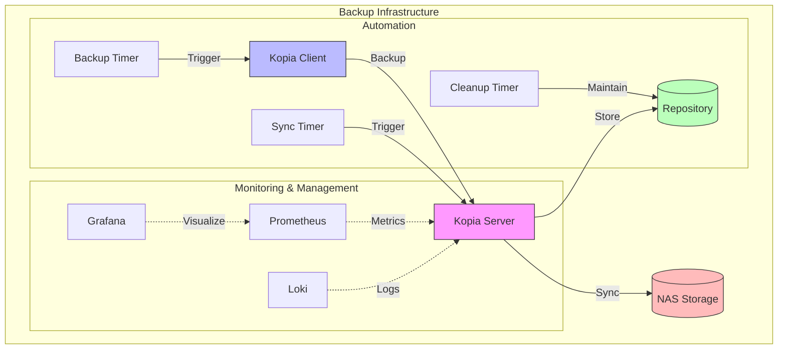

# 🚀 Kopia Backup System Run Scripts

Enterprise-grade backup solution using Kopia with Docker support.

## 🏗️ Architecture



## 📋 System Components

### Core Components
- **Kopia Server**: Central backup management
- **Kopia Client**: Backup agent
- **Repository**: Primary backup storage
- **NAS Sync**: Secondary storage sync

### Automation Components
- **Systemd Services**: Service management
- **Timers**: Scheduled operations
- **Cleanup**: Automated maintenance

### Monitoring Stack (Optional)
- **Prometheus**: Metrics collection
- **Grafana**: Visualization
- **Loki**: Log aggregation

## 📋 Prerequisites

### Server Requirements
- Docker Engine 20.10+
- Docker Compose 2.0+
- 2GB RAM minimum (4GB recommended)
- 2 CPU cores minimum
- 10GB free disk space
- NFS client utilities
- Network access to NAS

### Client Requirements
- Docker Engine 20.10+
- Docker Compose 2.0+
- 1GB RAM minimum
- Network access to Kopia server

## 🚀 Quick Start Guide

### 1. Clone Repository
```bash
git clone https://github.com/eblet/kopia-backup-run
cd kopia-backup-run
```

### 2. Initial Setup

1. Create environment file:
```bash
cp .env.example .env
```

2. Configure essential variables in .env:
```bash
# Security
KOPIA_REPO_PASSWORD=your-strong-password      # min 16 chars
KOPIA_SERVER_USERNAME=your-username           # min 8 chars
KOPIA_SERVER_PASSWORD=your-strong-password    # min 16 chars

# Network
KOPIA_SERVER_IP=your-server-ip
KOPIA_SERVER_PORT=51515

# NAS Configuration
NAS_IP=your-nas-ip
NAS_SHARE=/your/nas/share
NAS_MOUNT_PATH=/mnt/nas

# Paths
KOPIA_BASE_DIR=/var/lib/kopia
KOPIA_CONFIG_DIR=~/.config/kopia
KOPIA_CACHE_DIR=~/.cache/kopia
KOPIA_LOG_DIR=/var/log/kopia
```

### 3. Server Deployment

1. Install dependencies:
```bash
sudo apt update
sudo apt install -y docker.io docker-compose nfs-common
```

2. Run server setup:
```bash
sudo ./scripts/kopia_server_setup.sh
```

3. Verify server status:
```bash
docker ps | grep kopia-server
docker logs kopia-server
```

### 4. Client Setup

1. Configure backup volumes in .env:
```json
DOCKER_VOLUMES='{
    "/path/to/backup": {
        "name": "my-backup",
        "tags": ["prod", "data"],
        "compression": "zstd-fastest",
        "priority": 1
    }
}'
```

2. Run backup:
```bash
./scripts/kopia_client_docker_run.sh
```

## 📝 Configuration Guide

### Directory Structure
```
/var/lib/kopia/          # Base directory (KOPIA_BASE_DIR)
├── repository/          # Repository location (KOPIA_REPO_PATH)
/var/log/kopia/         # Logs directory (KOPIA_LOG_DIR)
~/.config/kopia/        # Client config (KOPIA_CONFIG_DIR)
~/.cache/kopia/         # Cache directory (KOPIA_CACHE_DIR)
/mnt/nas/               # NAS mount point (NAS_MOUNT_PATH)
```

### Essential Environment Variables

```properties
# Security
KOPIA_REPO_PASSWORD=        # Repository password
KOPIA_SERVER_USERNAME=      # Server username
KOPIA_SERVER_PASSWORD=      # Server password
KOPIA_SECURE_MODE=false    # Enable TLS

# Paths
KOPIA_BASE_DIR=            # Base directory
KOPIA_CONFIG_DIR=          # Client config
KOPIA_CACHE_DIR=           # Cache directory
KOPIA_LOG_DIR=             # Log directory

# Container Paths
KOPIA_CONTAINER_CONFIG_DIR=/app/config
KOPIA_CONTAINER_CACHE_DIR=/app/cache

# Performance
KOPIA_PARALLEL_CLIENT=4    # Parallel operations
KOPIA_CACHE_SIZE=5G       # Cache size
```

## 🔍 Monitoring & Maintenance

### Check Service Status
```bash
# Server
docker logs kopia-server
systemctl status kopia-server

# Client
docker logs kopia-client
tail -f ${KOPIA_LOG_DIR}/client.log
```

### Backup Management
```bash
# List snapshots
docker exec kopia-server kopia snapshot list

# Verify repository
docker exec kopia-server kopia repository status
```

## 🛟 Troubleshooting

### Common Issues

1. Permission Problems:
```bash
# Fix directory permissions
sudo chown -R $(id -u):$(id -g) ${KOPIA_CONFIG_DIR}
sudo chown -R $(id -u):$(id -g) ${KOPIA_CACHE_DIR}
sudo chmod 750 ${KOPIA_LOG_DIR}
```

2. NAS Connection Issues:
```bash
# Check NAS mount
sudo mountpoint -q ${NAS_MOUNT_PATH}
sudo showmount -e ${NAS_IP}

# Remount if needed
sudo mount -a
```

3. Server Connection Problems:
```bash
# Check server availability
curl -v http://${KOPIA_SERVER_IP}:${KOPIA_SERVER_PORT}

# Check logs
tail -f ${KOPIA_LOG_DIR}/server.log
```

### Logs Location
- Server logs: ${KOPIA_LOG_DIR}/server.log
- Client logs: ${KOPIA_LOG_DIR}/client.log
- Docker logs: `docker logs kopia-server/kopia-client`

## 🔒 Security Recommendations

1. Use strong passwords (16+ characters)
2. Enable TLS in production (KOPIA_SECURE_MODE=true)
3. Restrict server access by IP (KOPIA_SERVER_ALLOWED_IPS)
4. Regularly update Docker images
5. Monitor logs for unauthorized access attempts

## 📚 Additional Resources

- [Kopia Documentation](https://kopia.io/docs/)
- [Docker Documentation](https://docs.docker.com/)
- [NFS Setup Guide](https://help.ubuntu.com/community/NFSv4Howto)

## 🤝 Contributing

1. Fork the repository
2. Create feature branch
3. Commit changes
4. Push to branch
5. Create Pull Request

## 📄 License

This project is licensed under the MIT License - see the LICENSE file for details.

## 🔒 Security Configuration

### TLS Setup

1. Generate self-signed certificate:
```bash
# Generate private key and certificate
openssl req -x509 -newkey rsa:4096 \
  -keyout /etc/kopia/key.pem \
  -out /etc/kopia/cert.pem \
  -days 365 -nodes \
  -subj "/CN=kopia-server"

# Set proper permissions
chmod 600 /etc/kopia/key.pem
chmod 644 /etc/kopia/cert.pem
```

2. Configure TLS in .env:
```bash
KOPIA_SECURE_MODE=true
KOPIA_TLS_CERT_PATH=/etc/kopia/cert.pem
KOPIA_SERVER_ALLOWED_IPS=10.0.0.0/24,192.168.1.0/24
```

3. Verify TLS configuration:
```bash
# Check certificate
openssl x509 -in /etc/kopia/cert.pem -text -noout

# Test HTTPS connection
curl -k https://localhost:${KOPIA_SERVER_PORT}/api/v1/repo/status
```

## 📊 Monitoring & Observability

### Metrics Collection

1. Enable Prometheus metrics:
```yaml
# docker-compose.server.yml
services:
  kopia-server:
    labels:
      - "prometheus.enable=true"
      - "prometheus.port=9091"
```

2. Configure Prometheus:
```yaml
# prometheus.yml
scrape_configs:
  - job_name: 'kopia'
    static_configs:
      - targets: ['kopia-server:9091']
```

### Grafana Dashboard

1. Import Kopia dashboard:
```bash
curl -X POST \
  -H "Content-Type: application/json" \
  -d @dashboards/kopia.json \
  http://grafana:3000/api/dashboards/db
```

2. Key metrics to monitor:
- Repository size and growth
- Backup duration and success rate
- Network bandwidth usage
- Resource utilization

### Log Aggregation

1. Configure Loki:
```yaml
# loki.yml
scrape_configs:
  - job_name: kopia
    docker_sd_configs:
      - host: unix:///var/run/docker.sock
    labels:
      - service=kopia
```

2. View logs in Grafana:
```
{container_name=~"kopia-.*"} 
  | logfmt 
  | level="error"
```

### Health Monitoring

1. Check service health:
```bash
# Server health
curl -s http://localhost:51515/api/v1/repo/status | jq .

# Client status
docker exec kopia-client kopia repository status
```

2. Setup alerts:
```yaml
# alertmanager.yml
groups:
  - name: kopia
    rules:
      - alert: BackupFailed
        expr: kopia_backup_status != 0
        for: 1h
```

## 🔍 Performance Tuning

### Resource Optimization

1. Cache settings:
```bash
# Adjust cache size based on available memory
KOPIA_CACHE_SIZE=10G
```

2. Parallel processing:
```bash
# Increase for better performance on multi-core systems
KOPIA_PARALLEL_CLIENT=8
```

3. Network tuning:
```bash
# Limit bandwidth during business hours
KOPIA_UPLOAD_LIMIT=50M
KOPIA_DOWNLOAD_LIMIT=50M
```

### Backup Optimization

1. Compression levels:
```json
{
  "compression": "zstd-max",  # Better compression
  "compression": "zstd-fastest"  # Better speed
}
```

2. Scheduling:
```bash
# Spread backups across time
CLIENT_BACKUP_TIME="0 */4 * * *"  # Every 4 hours
```

## 📈 Capacity Planning

### Storage Requirements

1. Repository sizing:
- Base: 1.5x data size
- Growth: Monitor with `kopia repository stats`
- Retention: Adjust `BACKUP_RETENTION_DAYS`

2. Cache sizing:
```bash
# Rule of thumb: 10% of repository size
KOPIA_CACHE_SIZE=$(( $(du -s ${KOPIA_REPO_PATH} | cut -f1) / 10 ))G
```

### Resource Requirements

1. Memory allocation:
```bash
# Server: 2GB base + 1GB per TB of data
KOPIA_SERVER_MEM_LIMIT=4G

# Client: 1GB base + 512MB per concurrent backup
KOPIA_CLIENT_MEM_LIMIT=2G
```

2. CPU allocation:
```bash
# Server: 2 cores minimum
KOPIA_SERVER_CPU_LIMIT=2

# Client: 1 core per parallel backup
KOPIA_CLIENT_CPU_LIMIT=$(nproc)
```