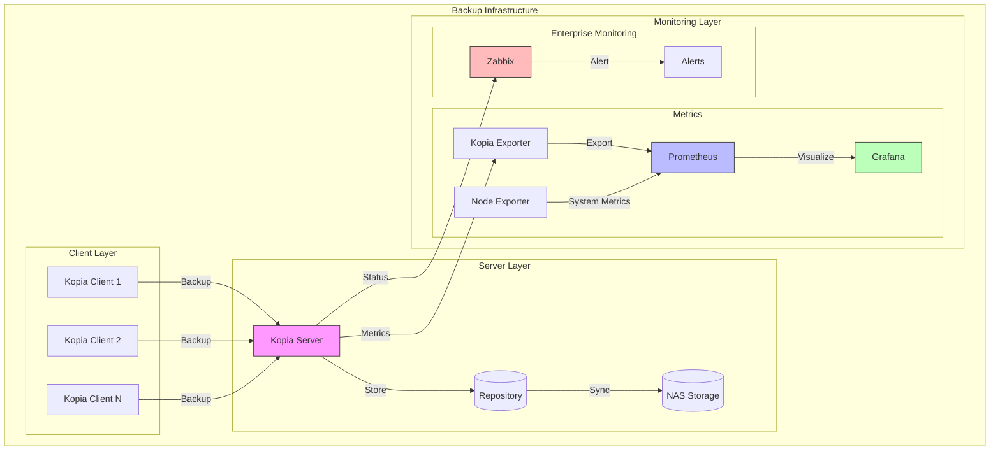

# 🚀 Kopia Backup System + Monitoring Stack

## 📋 Overview
Modular backup solution with optional monitoring:
- 🔄 Core: Kopia Server & Client
- 📊 Optional: Monitoring Stack
- 🔐 Secure and scalable
- 🚀 Easy deployment

## 🏗️ Architecture



## 🚀 Quick Start

### 1. Core Setup (Required)

#### Prerequisites
```bash
# Minimum requirements
- Docker Engine 20.10+
- Docker Compose 2.0+
- 2GB RAM
- 1 CPU core
```

#### Basic Installation
```bash
# Clone repository
git clone https://github.com/yourusername/kopia-backup-system
cd kopia-backup-system

# Configure core settings
cp .env.example .env
nano .env

# Deploy Kopia server
./scripts/setup.sh
docker-compose -f docker/docker-compose.server.yml up -d

# Verify deployment
docker logs kopia-server
```

### 2. Monitoring Setup (Optional)

If you want to add monitoring later:

```bash
# Deploy monitoring stack
./scripts/setup_monitoring.sh

# Access dashboards
- Grafana: http://localhost:3000
- Prometheus: http://localhost:9090
```

## 🔧 Core Configuration

### Required Environment Variables
| Variable | Description | Required | Default |
|----------|-------------|----------|---------|
| KOPIA_REPO_PASSWORD | Repository encryption | ✅ | - |
| KOPIA_SERVER_USERNAME | Admin username | ✅ | - |
| KOPIA_SERVER_PASSWORD | Admin password | ✅ | - |
| KOPIA_SERVER_IP | Server address | ✅ | - |

### Example Configurations

#### Minimal Setup
```bash
KOPIA_REPO_PASSWORD=strong-password-here
KOPIA_SERVER_USERNAME=admin
KOPIA_SERVER_PASSWORD=another-strong-password
KOPIA_SERVER_IP=192.168.1.100
```

#### Production Setup
```bash
# Security
KOPIA_SECURE_MODE=true
KOPIA_SERVER_ALLOWED_IPS=10.0.0.0/24

# Performance
KOPIA_PARALLEL_SERVER=4
KOPIA_CACHE_SIZE=10G

# Monitoring
MONITORING_TYPE=all
GRAFANA_ADMIN_PASSWORD=secure-password
```

## 📊 Monitoring Options

### 1. Basic Monitoring
```bash
# Server status
docker logs kopia-server
docker exec kopia-server kopia repository status
```

### 2. Enterprise Monitoring
Enable full monitoring stack:
```bash
# Edit .env
MONITORING_TYPE=all  # all, zabbix, prometheus, none

# Deploy
./scripts/setup_monitoring.sh
```

### 3. Available Metrics
- 📈 Backup size and duration
- 💾 Repository status
- 🔄 Sync status
- 📊 System resources

## 🛠 Troubleshooting

### Common Issues

1. Connection Problems
```bash
# Check Docker networks
docker network ls
docker network inspect kopia_network

# Verify services
docker ps | grep kopia
```

2. Permission Issues
```bash
# Fix permissions
sudo chown -R 65534:65534 /var/lib/prometheus
sudo chown -R 472:472 /var/lib/grafana
```

3. Monitoring Issues
```bash
# Check logs
docker logs kopia-prometheus
docker logs kopia-grafana
docker logs kopia-exporter
```

## 📚 Documentation
- [Detailed Configuration](docs/configuration.md)
- [Monitoring Guide](monitoring/README.md)
- [Security Guide](docs/security.md)

## 🤝 Contributing
1. Fork repository
2. Create feature branch
3. Commit changes
4. Create pull request

## 📄 License
MIT License - see LICENSE file