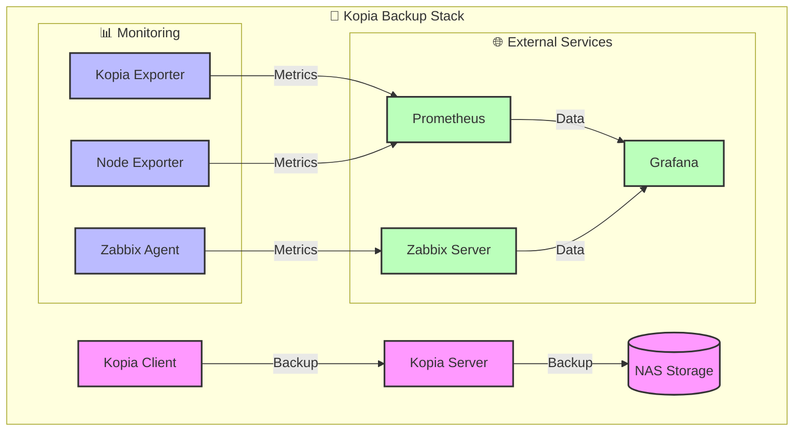
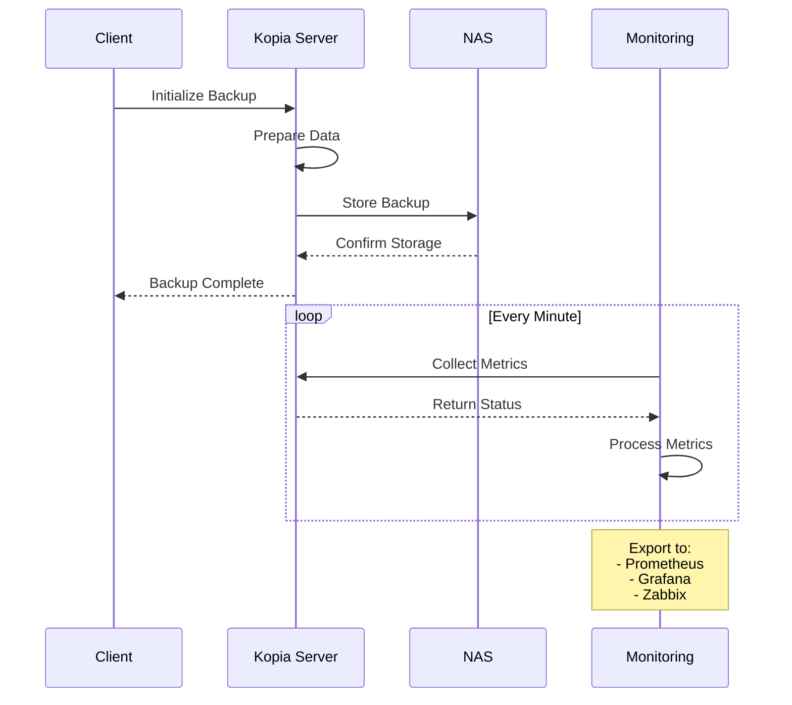

# 🚀 Kopia Backup System + Monitoring Stack

## 📋 Overview
Docker-based backup solution using Kopia with comprehensive monitoring capabilities.

## ✨ Features
- 🔄 Automated Kopia server setup
- 💾 NAS synchronization
- 📊 Monitoring integration (Prometheus, Grafana, Zabbix)
- 📝 Log rotation
- 🧹 Automatic cleanup

## 🎯 Architecture



## 🔄 Data Flow



## 🛠️ Prerequisites
```bash
# Install required packages
sudo apt-get update
sudo apt-get install -y docker.io docker-compose curl nfs-common jq
```

## 🚀 Quick Start
```bash
# Clone repository
git clone https://github.com/your-repo/kopia-backup-stack.git
cd kopia-backup-stack

# Configure environment
cp .env.example .env
nano .env

# Run setup
./scripts/setup_server.sh
```

## ⚙️ Configuration

### 🔑 Environment Variables
Copy `.env.example` to `.env` and configure:

```bash
# Server Configuration
KOPIA_BASE_DIR=/var/lib/kopia
KOPIA_LOG_DIR=/var/log/kopia
KOPIA_CACHE_DIR=/var/cache/kopia
KOPIA_REPO_PASSWORD=your-repository-password

# NAS Configuration
NAS_IP=192.168.1.100
NAS_SHARE=/backup
NAS_MOUNT_PATH=/mnt/nas

# Monitoring Configuration
MONITORING_PROFILE=none  # See profiles below
```

### 📊 Monitoring Profiles

1. 🚫 No Monitoring
```bash
MONITORING_PROFILE=none
```

2. 📈 Basic Metrics (Prometheus + Exporters)
```bash
MONITORING_PROFILE=base-metrics
```

3. 📊 Local Grafana Stack
```bash
MONITORING_PROFILE=grafana-local
GRAFANA_ADMIN_PASSWORD=your-password
```

4. 🌐 External Grafana
```bash
MONITORING_PROFILE=grafana-external
GRAFANA_URL=http://your-grafana:3000
GRAFANA_API_KEY=your-api-key
```

5. 🌍 External Zabbix Integration
```bash
MONITORING_PROFILE=zabbix-external
ZABBIX_SERVER_HOST=your-zabbix-server
ZABBIX_URL=http://your-zabbix/api_jsonrpc.php
```

6. 📡 External Prometheus Integration
```bash
MONITORING_PROFILE=prometheus-external
PROMETHEUS_SCRAPE=true
KOPIA_EXPORTER_PORT=9091
NODE_EXPORTER_PORT=9100
```

7. 🌟 Multiple External Services
```bash
# For Grafana + Zabbix + Prometheus
MONITORING_PROFILE=all-external

# Required settings:
GRAFANA_ENABLED=true
GRAFANA_EXTERNAL=true
GRAFANA_URL=http://your-grafana:3000
GRAFANA_API_KEY=your-api-key

ZABBIX_ENABLED=true
ZABBIX_EXTERNAL=true
ZABBIX_URL=http://your-zabbix/api_jsonrpc.php
ZABBIX_SERVER_HOST=your-zabbix-server

PROMETHEUS_EXTERNAL=true
PROMETHEUS_SCRAPE=true
```

### 📊 Monitoring Setup
```bash
# After configuring .env
./scripts/setup_monitoring.sh
```

## 📁 Directory Structure
```
kopia-backup-stack/
├── 🐳 docker/
│   ├── docker-compose.server.yml
│   └── docker-compose.zabbix_agent.yml
├── 📊 monitoring/
│   ├── docker-compose.monitoring.yml
│   ├── exporters/
│   │   └── kopia-exporter/
│   └── zabbix/
│       └── config/
├── 📜 scripts/
│   ├── setup_server.sh
│   ├── setup_monitoring.sh
│   └── setup_client.sh
└── .env.example
```

## 🛠️ Maintenance

### 📝 Log Rotation
Logs are automatically rotated using logrotate:
- 📅 Daily rotation
- 🗓️ 7 days retention
- 🗜️ Compression enabled

### 🧹 Cleanup
Automatic cleanup of:
- 📜 Old logs (>7 days)
- 🐳 Unused Docker images
- 🗑️ Temporary files

## 🔍 Troubleshooting

### 🔄 Check Services
```bash
# Server status
systemctl status kopia-server

# Monitoring status
docker compose -f monitoring/docker-compose.monitoring.yml ps

# Logs
journalctl -u kopia-server
docker compose -f monitoring/docker-compose.monitoring.yml logs
```

### ❗ Common Issues
1. 🔌 Port conflicts
```bash
# Check used ports
ss -tulpn | grep -E ':(51515|9090|9091|9100|10050)'
```

2. 🔒 Permission issues
```bash
# Fix permissions
chown -R root:root /var/lib/kopia
chmod 750 /var/lib/kopia
```

## 📝 Notes
> 💡 Graph shows the main components and their interactions. Each component can be configured independently.
> 
> 🔗 External services can be mixed and matched based on your needs.
> 
> 🎯 The goal is to provide flexibility while maintaining simplicity.

## 📄 License
MIT
