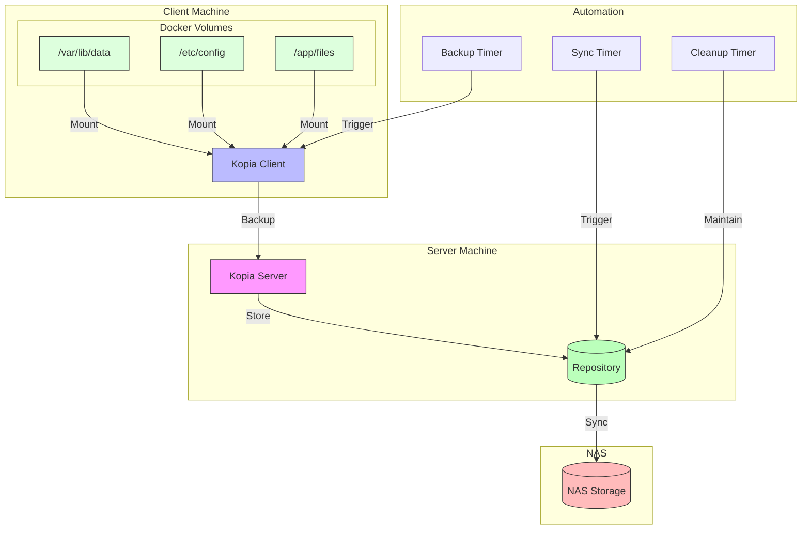
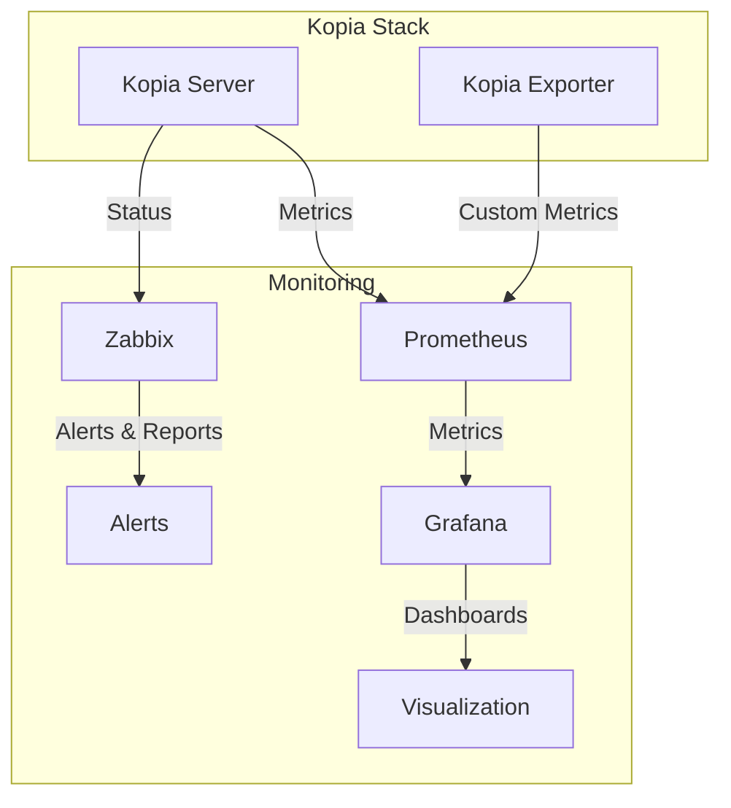

# 🚀 Kopia Backup System Run Scripts

## 📋 Overview

Kopia Backup System provides a robust, containerized backup solution with:
- 🔄 Centralized backup server
- 📱 Distributed backup clients
- 💾 NAS synchronization (tested with Synology)
- ⚡ Automated maintenance
- 📊 Monitoring capabilities

## 🏗️ Architecture



## 🔧 System Components

### 🛠️ Core Components
- 🖥️ **Kopia Server**: Central backup management
- 📱 **Kopia Client**: Backup agent
- 💾 **Repository**: Primary backup storage
- 🔄 **NAS Sync**: Secondary storage sync

### ⚡ Automation
- ⚙️ **Systemd Services**: Service management
- ⏰ **Timers**: Scheduled operations
- 🧹 **Cleanup**: Automated maintenance

## 💻 Requirements

### 🖥️ Server
- 🐳 Docker Engine 20.10+
- 🔄 Docker Compose 2.0+
- 💾 2GB RAM minimum (4GB recommended)
- 🔲 2 CPU cores minimum
- 💽 10GB free disk space
- 📡 NFS client utilities
- 🌐 Network access to NAS

### 📱 Client
- 🐳 Docker Engine 20.10+
- 🔄 Docker Compose 2.0+
- 💾 1GB RAM minimum
- 🌐 Network access to server
- 🔧 jq utility

## 🚀 Quick Start

### 📥 1. Installation

```bash
# Clone repository
git clone https://github.com/eblet/kopia-backup-run
cd kopia-backup-run

# Copy environment file
cp .env.example .env

# Install dependencies (Server only)
sudo apt update
sudo apt install -y docker.io docker-compose nfs-common
```

### ⚙️ 2. Configuration

Edit .env file with your settings:
```bash
# Security (Required)
KOPIA_REPO_PASSWORD=<strong-password>     # min 16 chars
KOPIA_SERVER_USERNAME=<username>          # min 8 chars
KOPIA_SERVER_PASSWORD=<strong-password>   # min 16 chars

# Network (Required)
KOPIA_SERVER_IP=<server-ip>
KOPIA_SERVER_PORT=51515

# NAS Configuration (Server only)
NAS_IP=<nas-ip>
NAS_SHARE=<share-path>
NAS_MOUNT_PATH=/mnt/nas
```

### 🌐 3. Server Deployment

```bash
# Run server setup
sudo ./scripts/kopia_server_setup.sh

# Verify deployment
systemctl status kopia-server
docker logs kopia-server
```

### 💾 4. Client Setup

1. Configure backup volumes:
```json
DOCKER_VOLUMES='{
    "/path/to/backup": {
        "name": "app-data",
        "tags": ["prod", "data"],
        "compression": "zstd-fastest",
        "priority": 1
    }
}'
```

2. Run backup:
```bash
./scripts/kopia_client_docker_run.sh
```

## 🛠️ Configuration Guide

### 📁 Directory Structure
```
/var/lib/kopia/          # Base directory
├── repository/          # Repository storage
/var/log/kopia/         # Logs directory
~/.config/kopia/        # Client config
~/.cache/kopia/         # Cache directory
/mnt/nas/               # NAS mount point
```

### 🔐 Security Configuration

#### 🔒 TLS Setup
1. Generate certificate:
```bash
sudo mkdir -p /etc/kopia
sudo openssl req -x509 -newkey rsa:4096 \
  -keyout /etc/kopia/key.pem \
  -out /etc/kopia/cert.pem \
  -days 365 -nodes \
  -subj "/CN=kopia-server"
```

2. Configure TLS:
```bash
KOPIA_SECURE_MODE=true
KOPIA_TLS_CERT_PATH=/etc/kopia/cert.pem
KOPIA_SERVER_ALLOWED_IPS=10.0.0.0/24
```

### ⚡ Performance Optimization

1. Cache Settings:
```bash
# Memory-based sizing
KOPIA_CACHE_SIZE=5G
KOPIA_PARALLEL_CLIENT=4
```

2. Network Limits:
```bash
# Bandwidth control
KOPIA_UPLOAD_LIMIT=50M
KOPIA_DOWNLOAD_LIMIT=50M
```

### 📊 Resource Planning

1. Server Resources:
```bash
# Scale with data size
KOPIA_SERVER_CPU_LIMIT=2
KOPIA_SERVER_MEM_LIMIT=4G
```

2. Client Resources:
```bash
# Scale with backup size
KOPIA_CLIENT_CPU_LIMIT=4
KOPIA_CLIENT_MEM_LIMIT=2G
```

## 📊 Monitoring & Maintenance

### 🔍 Monitoring Options

#### 1. Basic Monitoring
```bash
# Manual checks
docker exec kopia-server kopia snapshot list
docker exec kopia-server kopia repository status
```

#### 2. Enterprise Monitoring
Enable monitoring stack:
```bash
# Edit monitoring settings in .env
MONITORING_TYPE=all  # all, zabbix, prometheus, none

# Deploy monitoring
./scripts/setup_monitoring.sh
```

Available monitoring options:
- 🔍 **Zabbix**: Enterprise-grade monitoring and alerting
- 📊 **Prometheus + Grafana**: Real-time metrics and visualization
- 🔄 **Combined**: Both systems for comprehensive monitoring

Access monitoring:
- Zabbix: Configure in your Zabbix server
- Prometheus: http://localhost:9090
- Grafana: http://localhost:3000

[Detailed Monitoring Setup](monitoring/README.md)

### 🔐 Security Configuration

#### 🔒 TLS Setup
1. Generate certificate:
```bash
sudo mkdir -p /etc/kopia
sudo openssl req -x509 -newkey rsa:4096 \
  -keyout /etc/kopia/key.pem \
  -out /etc/kopia/cert.pem \
  -days 365 -nodes \
  -subj "/CN=kopia-server"
```

2. Configure TLS:
```bash
KOPIA_SECURE_MODE=true
KOPIA_TLS_CERT_PATH=/etc/kopia/cert.pem
KOPIA_SERVER_ALLOWED_IPS=10.0.0.0/24
```

### ⚡ Performance Optimization

1. Cache Settings:
```bash
# Memory-based sizing
KOPIA_CACHE_SIZE=5G
KOPIA_PARALLEL_CLIENT=4
```

2. Network Limits:
```bash
# Bandwidth control
KOPIA_UPLOAD_LIMIT=50M
KOPIA_DOWNLOAD_LIMIT=50M
```

### 📊 Resource Planning

1. Server Resources:
```bash
# Scale with data size
KOPIA_SERVER_CPU_LIMIT=2
KOPIA_SERVER_MEM_LIMIT=4G
```

2. Client Resources:
```bash
# Scale with backup size
KOPIA_CLIENT_CPU_LIMIT=4
KOPIA_CLIENT_MEM_LIMIT=2G
```

## 📊 Monitoring & Maintenance

### 🔍 Monitoring Options

#### 1. Basic Monitoring
```bash
# Server checks
systemctl status kopia-server
docker logs kopia-server
tail -f /var/log/kopia/server.log
docker exec kopia-server kopia snapshot list
docker exec kopia-server kopia repository status

# Client checks
docker logs kopia-client
tail -f /var/log/kopia/client.log
```

#### 2. Zabbix Integration (Enterprise)
For detailed alerting and reporting with Zabbix 6.0+:
```bash
# Enable Zabbix monitoring
cd zabbix && ./setup.sh
```
[Detailed Zabbix Setup](zabbix/README.md)

#### 3. Prometheus + Grafana (Metrics)
For real-time metrics and visualization:
```bash
# Enable Prometheus monitoring
PROMETHEUS_ENABLE=true
PROMETHEUS_PORT=9091
```
[Detailed Prometheus Setup](prometheus/README.md)

### 📈 Monitoring Architecture


### 💾 Backup Management

```bash
# List snapshots
docker exec kopia-server kopia snapshot list

# Verify repository
docker exec kopia-server kopia repository status

# Manual sync to NAS
systemctl start kopia-nas-sync.service
```

### 📈 Metrics Collection (Optional)

#### 🔄 Basic Monitoring
```bash
# List snapshots
docker exec kopia-server kopia snapshot list

# Verify repository
docker exec kopia-server kopia repository status

# Manual sync to NAS
systemctl start kopia-nas-sync.service
```

#### 🔍 Zabbix Integration
For enterprise monitoring with Zabbix 6.0+:

1. Add monitoring configuration to .env:
```bash
# Zabbix monitoring settings
KOPIA_CONTAINER_NAME=kopia-server
ZABBIX_EXTERNAL_SCRIPTS=/usr/lib/zabbix/externalscripts
ZABBIX_AGENT_CONFIG=/etc/zabbix/zabbix_agentd.d
```

2. Install monitoring components:
```bash
# Install Zabbix agent if not installed
sudo apt install -y zabbix-agent

# Deploy monitoring
cd zabbix && ./setup.sh
```

3. Import template in Zabbix web interface:
- Go to Configuration → Templates
- Import template_kopia.yaml
- Assign template to your host

Monitored metrics include:
- 🔄 Backup status and validation
- 💾 Repository health and size
- 🌐 NAS connectivity
- 📊 Performance metrics

For detailed Zabbix setup and configuration, see [Zabbix Integration Guide](zabbix/README.md)

## 🛟 Troubleshooting

### ❗ Common Issues

1. Permission Problems:
```bash
# Fix permissions
sudo chown -R $(id -u):$(id -g) ~/.config/kopia
sudo chmod 750 /var/log/kopia
```

2. NAS Connection:
```bash
# Check NAS
sudo mountpoint -q /mnt/nas
sudo showmount -e $NAS_IP
```

3. Server Connection:
```bash
# Test connectivity
curl -v http://${KOPIA_SERVER_IP}:${KOPIA_SERVER_PORT}
```

### 📝 Log Locations
- 🖥️ Server: /var/log/kopia/server.log
- 📱 Client: /var/log/kopia/client.log
- 🔄 System: journalctl -u kopia-server

## 🔒 Security Best Practices

### 🔑 Strong Authentication
- 🔐 Use complex passwords (16+ chars)
- 🔒 Enable TLS in production
- 🛡️ Restrict server access by IP

### 🌐 Network Security
- 🔒 Use private networks
- 🛡️ Enable firewall rules
- 🔄 Regular security updates

### 🛡️ Data Protection
- ✅ Regular integrity checks
- 🔐 Encrypted backups
- 🔒 Secure NAS access

## 📚 Additional Resources

- 📖 [Kopia Documentation](https://kopia.io/docs/)
- 🐳 [Docker Documentation](https://docs.docker.com/)
- 🔧 [NFS Guide](https://help.ubuntu.com/community/NFSv4Howto)

## 🤝 Contributing

1. 🔀 Fork repository
2. 📝 Create feature branch
3. 💾 Commit changes
4. 📤 Create Pull Request

## 📄 License

MIT License - see LICENSE file
