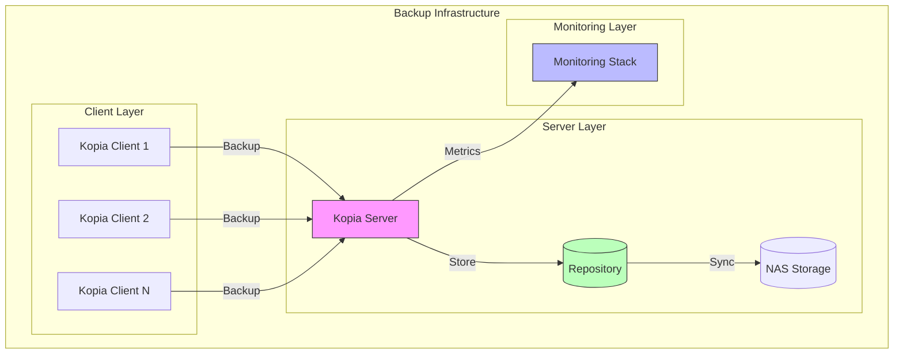

# 🚀 Kopia Backup System + Monitoring Stack

## 📋 Overview
Modular backup solution with optional monitoring:
- 🔄 Core: Kopia Server & Client
- 📊 Optional: Monitoring Stack
- 🔐 Secure and scalable
- 🚀 Easy deployment

## 🏗️ Architecture



## 🚀 Quick Start

### 1. Server Setup (Required)

#### Prerequisites
```bash
# Server Requirements
- Docker Engine 20.10+
- Docker Compose 2.0+
- 2GB RAM minimum
- 10GB disk space
- NFS server access (tested with Synology NAS)
```

#### Server Installation
```bash
# Clone repository
git clone https://github.com/eblet/kopia-backup-stack
cd kopia-backup-stack

# Configure server settings
cp .env.example .env
nano .env

# Required Server Variables
KOPIA_REPO_PASSWORD=strong-password-here      # Min 16 chars
KOPIA_SERVER_USERNAME=admin                   # Min 8 chars
KOPIA_SERVER_PASSWORD=another-strong-password # Min 16 chars
KOPIA_SERVER_IP=192.168.1.100                # Server IP

# NAS Configuration
NAS_IP=192.168.1.200
NAS_SHARE=/backup
NAS_MOUNT_PATH=/mnt/nas

# Deploy server
sudo ./scripts/setup_server.sh
# OR
docker-compose -f docker/docker-compose.server.yml up -d
```

#### Verify Server
```bash
# Check server status
systemctl status kopia-server

# Check logs
journalctl -u kopia-server

# Test repository
docker exec kopia-server kopia repository status
```

### 2. Client Setup

#### Prerequisites
```bash
# Client Requirements
- Docker Engine 20.10+
- Docker Compose 2.0+
- 1GB RAM minimum
- Access to Kopia server
```

#### Client Configuration
```bash
# Clone repository on client machine
git clone https://github.com/eblet/kopia-backup-stack
cd kopia-backup-stack

# Configure client settings
cp .env.example .env
nano .env

# Required Client Variables
KOPIA_REPO_PASSWORD=same-as-server-password
KOPIA_SERVER_USERNAME=admin
KOPIA_SERVER_PASSWORD=server-password
KOPIA_SERVER_IP=192.168.1.100    # Server IP

# Configure backup paths
DOCKER_VOLUMES='{
    "/path/to/config": {
        "name": "app-config",
        "tags": ["type:config"],
        "compression": "zstd-max",
        "priority": 1
    }
    "/path/to/data2": {
        "name": "app-data2",
        "tags": ["type:data2", "app:myapp2"],
        "compression": "zstd-fastest",
        "priority": 2
    },
}'
```

#### Run Client Backup
```bash
# Manual backup
cd /path/to/kopia-backup-stack
# Using script (recommended)
sudo ./scripts/setup_client.sh
# OR 
docker-compose -f docker/docker-compose.client.yml up -d

# Setup scheduled backup (optional)
sudo crontab -e

# Add schedule (example: daily at 2 AM)
# Using script (recommended):
0 2 * * * cd /path/to/kopia-backup-stack && ./scripts/kopia_client_docker_run.sh

# OR using docker-compose:
0 2 * * * cd /path/to/kopia-backup-stack && docker-compose -f docker/docker-compose.client.yml up -d
```

#### Verify Backup
```bash
# Check backup status and logs
docker logs kopia-client

# List snapshots
docker exec kopia-client kopia snapshot list

# Verify specific snapshot
docker exec kopia-client kopia snapshot verify latest
```

### 3. Monitoring Setup (Optional)

#### Available Monitoring Profiles
Choose the appropriate monitoring profile based on your needs:

1. Base Metrics (Minimal)
```bash
MONITORING_PROFILE=base-metrics
# Deploys:
- Prometheus
- Kopia Exporter
- Node Exporter
```

2. Local Grafana
```bash
MONITORING_PROFILE=grafana-local
# Adds to base metrics:
- Local Grafana instance
- Pre-configured dashboards
```
2.1. External Grafana
```bash
MONITORING_PROFILE=grafana-external
GRAFANA_ENABLED=true
GRAFANA_EXTERNAL=true
GRAFANA_URL=http://your-grafana:3000
GRAFANA_API_KEY=your-api-key
```

3. Local Zabbix
```bash
MONITORING_PROFILE=zabbix-local
# Adds to base metrics:
- Local Zabbix server
- Zabbix agent
- Monitoring templates
```

3.1. External Zabbix
```bash
MONITORING_PROFILE=zabbix-external
ZABBIX_ENABLED=true
ZABBIX_EXTERNAL=true
ZABBIX_URL=http://your-zabbix/api_jsonrpc.php
ZABBIX_SERVER_HOST=your-zabbix
```

4. External Grafana + External Zabbix
```bash
MONITORING_PROFILE=grafana-zabbix-external
# Required settings:
GRAFANA_ENABLED=true
GRAFANA_EXTERNAL=true
GRAFANA_URL=http://your-grafana:3000
GRAFANA_API_KEY=your-api-key
ZABBIX_ENABLED=true
ZABBIX_EXTERNAL=true
ZABBIX_URL=http://your-zabbix/api_jsonrpc.php
ZABBIX_SERVER_HOST=your-zabbix
```

5. Full Stack
```bash
MONITORING_PROFILE=full-stack
# Deploys all components locally:
- Prometheus + Exporters
- Local Grafana
- Local Zabbix
```

## Deploy monitoring stack
```bash
sudo ./scripts/setup_monitoring.sh
# OR
docker-compose -f monitoring/docker-compose.monitoring.yml up -d
```

## 🔧 Monitoring Options

### 1. Basic Monitoring
```bash
# Server status
docker logs kopia-server
docker exec kopia-server kopia repository status
```

### 2. Enterprise Monitoring
Enable full monitoring stack:
```bash
# Edit .env
MONITORING_TYPE=all  # all, zabbix, prometheus, none

# Deploy
./scripts/setup_monitoring.sh
```

### 3. Available Metrics
- 📈 Backup size and duration
- 💾 Repository status
- 🔄 Sync status
- 📊 System resources

# Access dashboards
- Grafana: http://localhost:3000
- Prometheus: http://localhost:9090
- Zabbix: http://localhost:9090

### Client Monitoring Setup

#### Enable Client Monitoring
```bash
# Edit .env file
ZABBIX_AGENT_ENABLED=true       # Enable Zabbix agent
ZABBIX_CLIENT_ENABLED=true      # Enable client monitoring
ZABBIX_SERVER_HOST=zabbix.local # Zabbix server hostname
KOPIA_CLIENT_HOSTNAME=myapp-01   # Custom hostname (optional)

# Deploy client with monitoring
./scripts/setup_client.sh
# OR
docker-compose -f docker/docker-compose.zabbix_agent.yml up -d
```

#### Available Client Metrics
- 📊 Backup status and timing
- 💾 Backup size and count
- ❌ Error monitoring
- 🔄 Sync status

#### Verify Client Monitoring
```bash
# Check agent status
docker ps | grep zabbix-agent
docker logs kopia-client-zabbix-agent

# Test agent connection
zabbix_get -s localhost -p 10050 -k kopia.client.backup.status
```

## 🛠 Troubleshooting

### Common Issues

1. Connection Problems
```bash
# Check Docker networks
docker network ls
docker network inspect kopia_network

# Verify services
docker ps | grep kopia
```

2. Permission Issues
```bash
# Fix permissions
sudo chown -R 65534:65534 /var/lib/prometheus
sudo chown -R 472:472 /var/lib/grafana
```

3. Monitoring Issues
```bash
# Check logs
docker logs kopia-prometheus
docker logs kopia-grafana
docker logs kopia-exporter
```

## 📚 Configuration Reference

### Server Configuration
| Variable | Description | Required | Default |
|----------|-------------|----------|---------|
| KOPIA_REPO_PASSWORD | Repository encryption | ✅ | - |
| KOPIA_SERVER_USERNAME | Admin username | ✅ | - |
| KOPIA_SERVER_PASSWORD | Admin password | ✅ | - |
| KOPIA_SERVER_IP | Server address | ✅ | - |
| NAS_IP | NAS server address | ✅ | - |
| NAS_SHARE | NFS share path | ✅ | - |
| KOPIA_SECURE_MODE | Enable TLS | ❌ | false |

### Client Configuration
| Variable | Description | Required | Default |
|----------|-------------|----------|---------|
| KOPIA_REPO_PASSWORD | Same as server | ✅ | - |
| KOPIA_SERVER_USERNAME | Server username | ✅ | - |
| KOPIA_SERVER_PASSWORD | Server password | ✅ | - |
| KOPIA_SERVER_IP | Server address | ✅ | - |
| DOCKER_VOLUMES | Backup paths | ✅ | - |
| BACKUP_VERIFY | Verify after backup | ❌ | true |

## 📚 Documentation
- [Monitoring Guide](monitoring/README.md)

## 🤝 Contributing
1. Fork repository
2. Create feature branch
3. Commit changes
4. Create pull request

## 📄 License
MIT License - see LICENSE file

