# 🚀 Kopia Backup Stack Documentation

## 📋 Overview
Enterprise-grade backup solution using Kopia with comprehensive monitoring capabilities.

- [Overview](#overview)
- [Architecture](#architecture)
- [Key Features](#key-features)
- [Quick Start](#quick-start)

### 🛠️ Chapter 2: Installation
- [Prerequisites](#prerequisites)
- [Basic Setup](#basic-setup)
- [Advanced Installation](#advanced-installation)
- [Post-Installation](#post-installation)

### 📊 Chapter 3: Monitoring
- [Monitoring Overview](#monitoring-overview)
- [Available Profiles](#monitoring-profiles)
- [Components](#monitoring-components)
- [Metrics & Alerts](#metrics-and-alerts)

### 🔐 Chapter 4: Security
- [Security Overview](#security-overview)
- [Authentication](#authentication)
- [Encryption](#encryption)
- [Network Security](#network-security)

### 🔧 Chapter 5: Maintenance
- [Routine Tasks](#routine-tasks)
- [Backup Management](#backup-management)
- [System Maintenance](#system-maintenance)
- [Troubleshooting](#troubleshooting)


---

# 📋 Chapter 1: Introduction

## Overview

Kopia Backup Stack is an enterprise-grade backup solution featuring:
- 🔄 Automated backup management
- 📊 Multi-level monitoring (Prometheus, Grafana, Zabbix)
- 🔐 Enhanced security with TLS support
- 📈 Performance metrics and analytics
- 🚨 Intelligent alerting system

## 🏗️ Architecture

```mermaid
graph TB
    subgraph "🔄 Backup Core"
        KS[Kopia Server]
        KC[Kopia Client]
        NAS[(NAS Storage)]
    end
    
    subgraph "📊 Monitoring Stack"
        PE[Prometheus]
        GF[Grafana]
        ZB[Zabbix]
        
        subgraph "🔍 Metrics Collection"
            KE[Kopia Exporter]
            NE[Node Exporter]
            ZA[Zabbix Agent]
        end
    end
    
    KC -->|Backup| KS
    KS -->|Store| NAS
    KE -->|Metrics| PE
    NE -->|System Metrics| PE
    ZA -->|Status| ZB
    PE -->|Data| GF
    ZB -->|Data| GF
```


## 🚀 Quick Start

### Backup Capabilities
- Incremental backups
- Data deduplication
- Compression
- Encryption
- Snapshot management

### Monitoring Features
- Real-time metrics
- Custom dashboards
- Alert management
- Performance analytics
- Multi-system integration

### Security Features
- TLS encryption
- Role-based access
- Audit logging
- Network isolation
- Certificate management

## Quick Start

```bash

# Clone repository
git clone https://github.com/eblet/kopia-backup-stack
cd kopia-backup-stack

# Configure environment
cp .env.example .env
nano .env

### Client Setup
./scripts/setup_server.sh

### Client Setup
./scripts/setup_client.sh

### Monitoring Setup
./scripts/setup_monitoring.sh

```

[Previous Installation Guide content...]

---

# 📊 Chapter 3: Monitoring

[Previous Monitoring Guide content...]

---

# 🔐 Chapter 4: Security

[Previous Security Guide content...]

---

# 🔧 Chapter 5: Maintenance

[Previous Maintenance Guide content...]

---

## 📚 Additional Resources

### 📖 Documentation
- [Kopia Documentation](https://kopia.io/docs/)
- [Prometheus Documentation](https://prometheus.io/docs/)
- [Grafana Documentation](https://grafana.com/docs/)
- [Zabbix Documentation](https://www.zabbix.com/documentation/)

### 🔗 Related Projects
- [Kopia](https://github.com/kopia/kopia)
- [Prometheus](https://github.com/prometheus/prometheus)
- [Grafana](https://github.com/grafana/grafana)
- [Zabbix](https://github.com/zabbix/zabbix)

### 📄 License
MIT License - see [LICENSE](LICENSE) for details.
