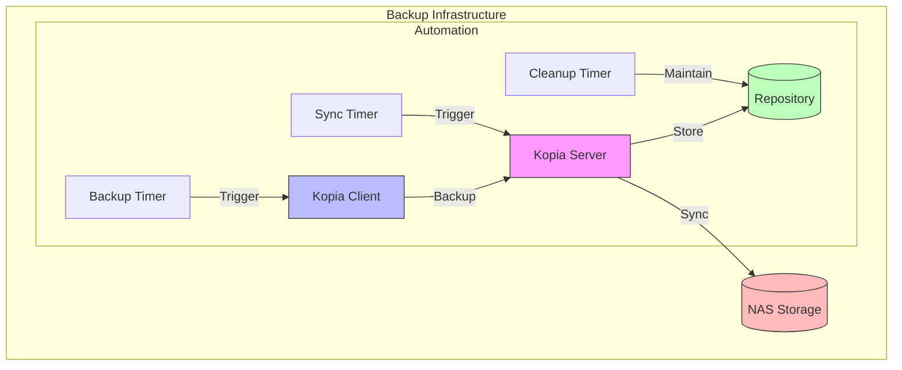

# 🚀 Kopia Backup System Run Scripts

Enterprise-grade backup solution using Kopia with Docker support.

## 📋 Overview

Kopia Backup System provides a robust, containerized backup solution with:
- Centralized backup server
- Distributed backup clients
- NAS synchronization
- Automated maintenance
- Monitoring capabilities

## 🏗️ Architecture



## 🔧 System Components

### Core Components
- **Kopia Server**: Central backup management
- **Kopia Client**: Backup agent
- **Repository**: Primary backup storage
- **NAS Sync**: Secondary storage sync

### Automation
- **Systemd Services**: Service management
- **Timers**: Scheduled operations
- **Cleanup**: Automated maintenance

## 📋 Requirements

### Server
- Docker Engine 20.10+
- Docker Compose 2.0+
- 2GB RAM minimum (4GB recommended)
- 2 CPU cores minimum
- 10GB free disk space
- NFS client utilities
- Network access to NAS

### Client
- Docker Engine 20.10+
- Docker Compose 2.0+
- 1GB RAM minimum
- Network access to server
- jq utility

## 🚀 Quick Start

### 1. Installation

```bash
# Clone repository
git clone https://github.com/eblet/kopia-backup-run
cd kopia-backup-run

# Copy environment file
cp .env.example .env

# Install dependencies (Server only)
sudo apt update
sudo apt install -y docker.io docker-compose nfs-common
```

### 2. Configuration

Edit .env file with your settings:
```bash
# Security (Required)
KOPIA_REPO_PASSWORD=<strong-password>     # min 16 chars
KOPIA_SERVER_USERNAME=<username>          # min 8 chars
KOPIA_SERVER_PASSWORD=<strong-password>   # min 16 chars

# Network (Required)
KOPIA_SERVER_IP=<server-ip>
KOPIA_SERVER_PORT=51515

# NAS Configuration (Server only)
NAS_IP=<nas-ip>
NAS_SHARE=<share-path>
NAS_MOUNT_PATH=/mnt/nas
```

### 3. Server Deployment

```bash
# Run server setup
sudo ./scripts/kopia_server_setup.sh

# Verify deployment
systemctl status kopia-server
docker logs kopia-server
```

### 4. Client Setup

1. Configure backup volumes:
```json
DOCKER_VOLUMES='{
    "/path/to/backup": {
        "name": "app-data",
        "tags": ["prod", "data"],
        "compression": "zstd-fastest",
        "priority": 1
    }
}'
```

2. Run backup:
```bash
./scripts/kopia_client_docker_run.sh
```

## ⚙️ Configuration Guide

### Directory Structure
```
/var/lib/kopia/          # Base directory
├── repository/          # Repository storage
/var/log/kopia/         # Logs directory
~/.config/kopia/        # Client config
~/.cache/kopia/         # Cache directory
/mnt/nas/               # NAS mount point
```

### Security Configuration

#### TLS Setup
1. Generate certificate:
```bash
sudo mkdir -p /etc/kopia
sudo openssl req -x509 -newkey rsa:4096 \
  -keyout /etc/kopia/key.pem \
  -out /etc/kopia/cert.pem \
  -days 365 -nodes \
  -subj "/CN=kopia-server"
```

2. Configure TLS:
```bash
KOPIA_SECURE_MODE=true
KOPIA_TLS_CERT_PATH=/etc/kopia/cert.pem
KOPIA_SERVER_ALLOWED_IPS=10.0.0.0/24
```

### Performance Optimization

1. Cache Settings:
```bash
# Memory-based sizing
KOPIA_CACHE_SIZE=5G
KOPIA_PARALLEL_CLIENT=4
```

2. Network Limits:
```bash
# Bandwidth control
KOPIA_UPLOAD_LIMIT=50M
KOPIA_DOWNLOAD_LIMIT=50M
```

### Resource Planning

1. Server Resources:
```bash
# Scale with data size
KOPIA_SERVER_CPU_LIMIT=2
KOPIA_SERVER_MEM_LIMIT=4G
```

2. Client Resources:
```bash
# Scale with backup size
KOPIA_CLIENT_CPU_LIMIT=4
KOPIA_CLIENT_MEM_LIMIT=2G
```

## 📊 Monitoring & Maintenance

### Service Status

```bash
# Server checks
systemctl status kopia-server
docker logs kopia-server
tail -f /var/log/kopia/server.log

# Client checks
docker logs kopia-client
tail -f /var/log/kopia/client.log
```

### Backup Management

```bash
# List snapshots
docker exec kopia-server kopia snapshot list

# Verify repository
docker exec kopia-server kopia repository status

# Manual sync to NAS
systemctl start kopia-nas-sync.service
```

### Metrics Collection (Optional)

1. Enable Prometheus metrics:
```yaml
labels:
  - "prometheus.enable=true"
  - "prometheus.port=9091"
```

2. Key metrics:
- Repository size/growth
- Backup success rate
- Resource usage
- Network bandwidth

## 🛟 Troubleshooting

### Common Issues

1. Permission Problems:
```bash
# Fix permissions
sudo chown -R $(id -u):$(id -g) ~/.config/kopia
sudo chmod 750 /var/log/kopia
```

2. NAS Connection:
```bash
# Check NAS
sudo mountpoint -q /mnt/nas
sudo showmount -e $NAS_IP
```

3. Server Connection:
```bash
# Test connectivity
curl -v http://${KOPIA_SERVER_IP}:${KOPIA_SERVER_PORT}
```

### Log Locations
- Server: /var/log/kopia/server.log
- Client: /var/log/kopia/client.log
- System: journalctl -u kopia-server

## 🔒 Security Best Practices

1. Strong Authentication:
   - Use complex passwords (16+ chars)
   - Enable TLS in production
   - Restrict server access by IP

2. Network Security:
   - Use private networks
   - Enable firewall rules
   - Regular security updates

3. Data Protection:
   - Regular integrity checks
   - Encrypted backups
   - Secure NAS access

## 📚 Additional Resources

- [Kopia Documentation](https://kopia.io/docs/)
- [Docker Documentation](https://docs.docker.com/)
- [NFS Guide](https://help.ubuntu.com/community/NFSv4Howto)

## 🤝 Contributing

1. Fork repository
2. Create feature branch
3. Commit changes
4. Create Pull Request

## 📄 License

MIT License - see LICENSE file