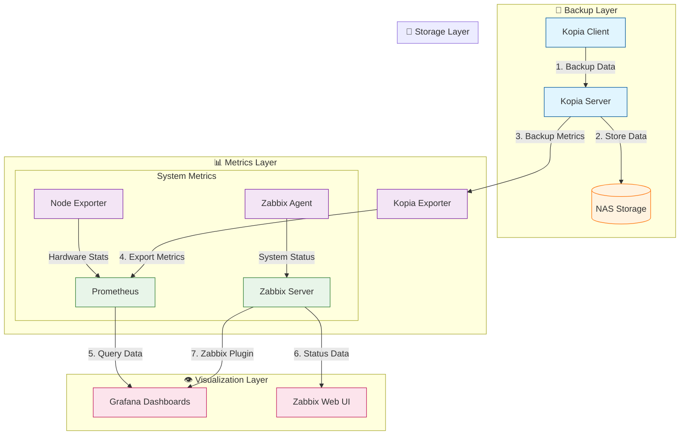

# 📋 Chapter 1: Introduction

## 📑 Table of Contents
- [System Overview](#system-overview)
- [Architecture Details](#architecture-details)
- [Core Components](#core-components)
- [Feature Details](#feature-details)
- [Getting Started](#getting-started)

## 🎯 System Overview

### 🎨 Purpose
Kopia Backup Stack provides an enterprise-grade backup solution with:
- 🔄 Automated backup management
- 📊 Comprehensive monitoring
- 🔐 Enhanced security features
- 📈 Performance analytics
- 📦 Scalable architecture

### 💼 Use Cases
- 🏢 Enterprise backup systems
- 🌐 Multi-server deployments
- 🔒 Secure data archiving
- ✅ Compliance requirements
- ⚡ Performance-critical environments

## 🏗️ Architecture Details

### Component Interaction


### 🔄 Data Flow
1. 📤 Client initiates backup
2. 🔍 Server processes and deduplicates
3. 💾 Data stored in repository
4. 📊 Metrics collected and exported
5. 📈 Monitoring systems process data
6. 👁️ Visualization and alerting

## 🧩 Core Components

### 💾 Backup Core
- 🖥️ **Kopia Server**: Central backup management
- 💻 **Kopia Client**: Backup agent
- 📦 **Repository**: Deduplicated storage
- 📸 **Snapshot System**: Point-in-time recovery

### 📊 Monitoring Stack
- 📈 **Prometheus**: Metrics collection
- 📊 **Grafana**: Visualization
- 🔍 **Zabbix**: Enterprise monitoring
- 🔌 **Custom Exporters**: Metric collection

### 🔐 Security Layer
- 🔒 **TLS Encryption**: Secure communication
- 🔑 **Authentication**: Access control
- 📝 **Audit System**: Activity tracking
- 🛡️ **Network Security**: Isolation and protection

## ⚙️ Feature Details

### 💾 Backup Features
1. 📸 **Snapshot Management**
   - 🔄 Incremental backups
   - 🎯 Deduplication
   - 📦 Compression
   - 🔐 Encryption

2. 📋 **Policy Control**
   - ⏰ Retention policies
   - 📅 Scheduling
   - 📊 Resource limits
   - 🔑 Access control

### 📊 Monitoring Features
1. 📈 **Metrics Collection**
   - ✅ Backup status
   - 📊 Performance metrics
   - 💻 Resource usage
   - 🏥 System health

2. 👁️ **Visualization**
   - 📊 Real-time dashboards
   - 📑 Custom reports
   - 📈 Trend analysis
   - 🚨 Alert management

### 🔐 Security Features
1. 🛡️ **Data Protection**
   - 🔒 End-to-end encryption
   - 🔑 Secure transport
   - 🚫 Access control
   - 📝 Audit logging

2. 🌐 **Network Security**
   - 🔐 TLS encryption
   - 🔒 Network isolation
   - 📜 Certificate management
   - 🛡️ Firewall rules

## 🚀 Getting Started

### 📋 Prerequisites
```bash
# System Requirements
- 💻 Linux-based OS (Ubuntu 20.04+ recommended)
- 🐳 Docker 20.10+
- 🔄 Docker Compose 2.0+
- 💾 2GB RAM minimum
- 💿 10GB disk space
```

### ⚡ Quick Setup
```bash
# Clone repository
git clone https://github.com/eblet/kopia-backup-stack
cd kopia-backup-stack
chmod +x scripts/*

# Initial configuration
cp .env.example .env
nano .env

# Start core services
./scripts/setup_server.sh
```

### ✅ Verification
```bash
# Check services
docker compose ps

# Test monitoring
curl -s http://localhost:9090/-/healthy
```

### 📝 Next Steps
1. ⚙️ Configure backup policies
2. 🚨 Set up monitoring alerts
3. 📊 Customize dashboards
4. 🔐 Implement security policies
5. 📅 Schedule maintenance tasks

[Continue to Chapter 2: Installation →](chapter2_installation.md) 