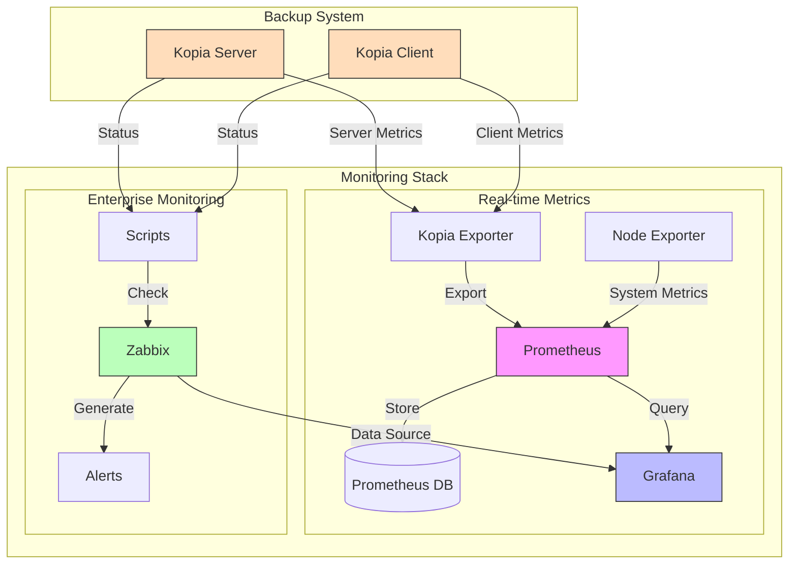

# 📊 Kopia Monitoring Stack

## 📋 Overview
Comprehensive monitoring solution for Kopia Backup System:
- 🔍 Real-time metrics collection via Prometheus
- 📈 Visual analytics through Grafana
- 🚨 Enterprise monitoring with Zabbix
- 📱 Mobile-friendly dashboards

## 🏗️ Architecture



## 🚀 Components

### 1. Prometheus Stack

#### Metrics Collection
- **Kopia Exporter**: Custom metrics from Kopia
  - Backup status and duration
  - Repository size and health
  - Snapshot statistics
- **Node Exporter**: System metrics
  - CPU, Memory, Disk usage
  - Network statistics
  - System load

### Integration Features
- Unified dashboards combining Prometheus and Zabbix metrics
- Cross-source alerting
- Combined visualization
- Single pane of glass monitoring

### 2. Zabbix Integration

#### Monitoring Features
- Active checks for backup status
- NAS connectivity monitoring
- Repository health verification
- Custom alert thresholds

#### Enterprise Capabilities
- Detailed reporting
- SLA monitoring
- Escalation procedures
- Multi-tenant support

## 🔧 Configuration Reference

### Environment Variables

#### Required Variables
| Variable | Description | Default | Example |
|----------|-------------|---------|---------|
| MONITORING_TYPE | Type of monitoring to enable | none | prometheus, zabbix, all |
| GRAFANA_ADMIN_PASSWORD | Grafana admin password | admin | secure-password |

#### Prometheus Settings
| Variable | Description | Default | Example |
|----------|-------------|---------|---------|
| PROMETHEUS_UI_PORT | Prometheus web interface port | 9090 | 9090 |
| PROMETHEUS_DATA_DIR | Data directory | /var/lib/prometheus | /data/prometheus |
| PROMETHEUS_RETENTION | Data retention period | 15d | 30d |
| PROMETHEUS_CPU_LIMIT | CPU limit for container | 1 | 2 |
| PROMETHEUS_MEM_LIMIT | Memory limit for container | 2G | 4G |

#### Grafana Settings
| Variable | Description | Default | Example |
|----------|-------------|---------|---------|
| GRAFANA_PORT | Web interface port | 3000 | 3000 |
| GRAFANA_ADMIN_PASSWORD | Admin password | admin | secure-password |
| GRAFANA_API_KEY | API key for integrations | - | generated-api-key |
| GRAFANA_PLUGINS | Additional plugins | - | grafana-piechart-panel |
| GRAFANA_CPU_LIMIT | CPU limit for container | 1 | 2 |
| GRAFANA_MEM_LIMIT | Memory limit for container | 1G | 2G |

#### Zabbix Settings
| Variable | Description | Default | Example |
|----------|-------------|---------|---------|
| ZABBIX_URL | Zabbix API URL | http://zabbix-web:80/api_jsonrpc.php | http://zabbix.local/api_jsonrpc.php |
| ZABBIX_USERNAME | Zabbix admin username | Admin | zabbix_admin |
| ZABBIX_PASSWORD | Zabbix admin password | zabbix | secure-password |
| ZABBIX_EXTERNAL_SCRIPTS | Scripts directory | /usr/lib/zabbix/externalscripts | /opt/zabbix/scripts |
| ZABBIX_AGENT_CONFIG | Agent config directory | /etc/zabbix/zabbix_agentd.d | /etc/zabbix/conf.d |

#### Logging Settings
| Variable | Description | Default | Example |
|----------|-------------|---------|---------|
| LOG_LEVEL | Logging level | info | debug |
| LOG_MAX_SIZE | Max log file size | 100M | 500M |
| LOG_MAX_FILES | Number of log files to keep | 7 | 14 |

## 📊 Available Metrics

### Core Metrics
| Metric | Type | Description | Labels |
|--------|------|-------------|--------|
| kopia_backup_duration_seconds | Gauge | Backup duration | path, status |
| kopia_backup_size_bytes | Gauge | Total backup size | path |
| kopia_snapshot_count | Gauge | Number of snapshots | type |
| kopia_repository_size_bytes | Gauge | Repository size | - |

### Performance Metrics
| Metric | Type | Description | Labels |
|--------|------|-------------|--------|
| kopia_upload_speed_bytes | Gauge | Upload speed | - |
| kopia_compression_ratio | Gauge | Data compression | path |
| kopia_deduplication_ratio | Gauge | Storage efficiency | - |

## 🔔 Alert Rules

### Critical Alerts
```yaml
- alert: KopiaBackupFailed
  expr: kopia_backup_status == 0
  for: 5m
  labels:
    severity: critical
  annotations:
    summary: "Backup operation failed"

- alert: KopiaRepositoryCorruption
  expr: kopia_repository_health == 0
  for: 1m
  labels:
    severity: critical
```

### Warning Alerts
```yaml
- alert: KopiaBackupTooOld
  expr: time() - kopia_last_backup > 86400
  labels:
    severity: warning

- alert: KopiaHighDiskUsage
  expr: kopia_repository_size_bytes / kopia_repository_quota_bytes > 0.85
  labels:
    severity: warning
```

## 🛠 Troubleshooting

### Common Issues

1. Metrics Not Available
```bash
# Check Prometheus targets
curl -s http://localhost:9090/api/v1/targets | jq .

# Verify Kopia exporter
curl -s http://localhost:9091/metrics | grep kopia_
```

2. Dashboard Problems
```bash
# Reset Grafana admin password
docker exec -it kopia-grafana grafana-cli admin reset-admin-password newpass

# Verify Prometheus datasource
curl http://localhost:3000/api/datasources/proxy/1/api/v1/query?query=up
```

3. Zabbix Integration
```bash
# Test monitoring scripts
/usr/lib/zabbix/externalscripts/check_kopia_backup.sh
/usr/lib/zabbix/externalscripts/check_repository.sh

# Check Zabbix agent logs
tail -f /var/log/zabbix/zabbix_agentd.log
```

## 🔒 Security

### Network Security
- Isolated monitoring network
- Internal service discovery
- TLS encryption (optional)
- Basic authentication

### Access Control
- Role-based access in Grafana
- API token authentication
- Restricted script permissions
- Audit logging

## 📚 Additional Resources
- [Prometheus Documentation](https://prometheus.io/docs/)
- [Grafana Best Practices](https://grafana.com/docs/grafana/latest/best-practices/)
- [Zabbix Integration Guide](https://www.zabbix.com/documentation/)
- [PromQL Cheat Sheet](https://promlabs.com/promql-cheat-sheet/)