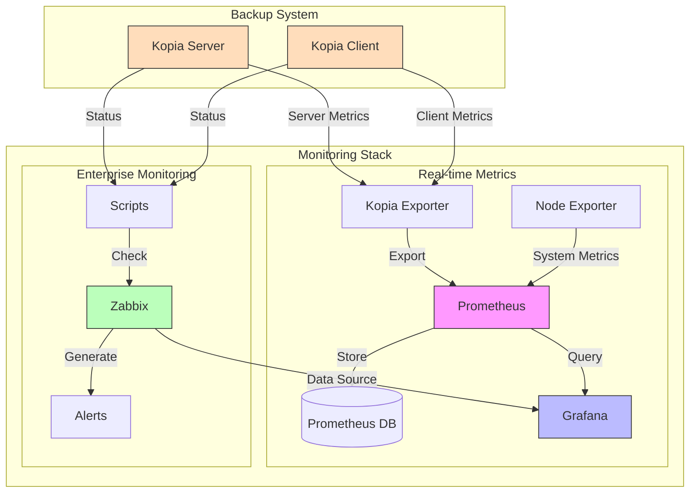

# 📊 Kopia Monitoring Stack

## 📋 Overview
Comprehensive monitoring solution for Kopia Backup System:
- 🔍 Real-time metrics collection via Prometheus
- 📈 Visual analytics through Grafana
- 🚨 Enterprise monitoring with Zabbix
- 📱 Mobile-friendly dashboards

## 🏗️ Architecture



## 🚀 Components

### 1. Prometheus Stack

#### Metrics Collection
- **Kopia Exporter**: Custom metrics from Kopia
  - Backup status and duration
  - Repository size and health
  - Snapshot statistics
- **Node Exporter**: System metrics
  - CPU, Memory, Disk usage
  - Network statistics
  - System load

### Integration Features
- Unified dashboards combining Prometheus and Zabbix metrics
- Cross-source alerting
- Combined visualization
- Single pane of glass monitoring

### 2. Zabbix Integration

#### Monitoring Features
- Active checks for backup status
- NAS connectivity monitoring
- Repository health verification
- Custom alert thresholds

#### Enterprise Capabilities
- Detailed reporting
- SLA monitoring
- Escalation procedures
- Multi-tenant support

#### External Zabbix Server
- Set `ZABBIX_EXTERNAL=true`
- Configure `ZABBIX_SERVER_HOST`
- Only agent and scripts will be deployed
- Metrics will be sent to external Zabbix server

### 3. External Monitoring Integration

#### 3.1. Configure external Grafana:
```bash
# In .env file
GRAFANA_EXTERNAL=true
GRAFANA_URL=http://your-grafana:3000
GRAFANA_API_KEY=your-api-key
```

#### 3.2. Add Prometheus data source in external Grafana:
1. Login to your Grafana instance
2. Go to Configuration -> Data Sources
3. Click "Add data source"
4. Select "Prometheus"
5. Configure the data source:
```yaml
# Basic Settings
Name: Kopia-Prometheus
Default: false  # Unless you want it as default

# HTTP Settings
URL: http://your-kopia-server:9090  # Your Prometheus server URL
Access: Server (default)  # or Browser if needed
Scrape interval: 15s

# Auth Settings (if needed)
Basic auth: Enable if required
User: your-user
Password: your-password

# TLS/SSL Settings
TLS Client Auth: Enable if using TLS
Skip TLS Verify: Only in dev environments
```
6. Click "Save & Test"

#### 3.3. Add Zabbix data source in external Grafana:
1. Install Zabbix plugin if not installed:
   - Go to Configuration -> Plugins
   - Search for "Zabbix"
   - Install "Zabbix" by Alexander Zobnin

2. Add Zabbix data source:
   - Go to Configuration -> Data Sources
   - Click "Add data source"
   - Search and select "Zabbix"

3. Configure Zabbix data source:
```yaml
# Basic Settings
Name: Kopia-Zabbix
Default: false

# HTTP Settings
URL: http://your-zabbix:80/api_jsonrpc.php  # Zabbix API URL
Access: Server (default)

# Zabbix API Settings
Username: ${ZABBIX_USERNAME}
Password: ${ZABBIX_PASSWORD}

# Advanced Settings
Trends: Enable
  From: 7d
  Range: 4d
Cache TTL: 1h
Timeout: 30s
```

4. Direct API Configuration (alternative):
```bash
# Using curl to add datasource
curl -X POST \
  -H "Content-Type: application/json" \
  -H "Authorization: Bearer ${GRAFANA_API_KEY}" \
  http://your-grafana:3000/api/datasources \
  -d '{
    "name": "Kopia-Zabbix",
    "type": "alexanderzobnin-zabbix-datasource",
    "url": "http://your-zabbix:80/api_jsonrpc.php",
    "access": "proxy",
    "jsonData": {
      "username": "Admin",
      "trendsFrom": "7d",
      "trendsRange": "4d",
      "cacheTTL": "1h"
    },
    "secureJsonData": {
      "password": "your-zabbix-password"
    }
  }'
```

#### 3.4. Import dashboards:
1. Download dashboard JSONs:
   - Copy files from monitoring/prometheus/dashboards/
   - Or download from Grafana.com marketplace

2. Import via Grafana UI:
   - Go to Dashboards -> Import
   - Upload JSON file or paste JSON content
   - Select:
     - Kopia-Prometheus for metrics dashboards
     - Kopia-Zabbix for Zabbix dashboards
   - Click "Import"

3. Import via API:
```bash
# Using curl to import dashboard
curl -X POST \
  -H "Content-Type: application/json" \
  -H "Authorization: Bearer ${GRAFANA_API_KEY}" \
  http://your-grafana:3000/api/dashboards/db \
  -d @monitoring/prometheus/dashboards/kopia-overview.json
```

#### 3.5. Verify Integration:
1. Check Prometheus data:
```bash
# Test Prometheus API
curl -s http://your-kopia-server:9090/api/v1/query?query=up

# Check targets
curl -s http://your-kopia-server:9090/api/v1/targets | jq .
```

2. Check Zabbix data:
```bash
# Test Zabbix API
curl -s -H "Content-Type: application/json" \
     -d '{"jsonrpc":"2.0","method":"apiinfo.version","id":1}' \
     http://your-zabbix:80/api_jsonrpc.php
```

3. Verify in Grafana:
   - Check "Data Sources" page for connection status
   - Use "Explore" to test queries
   - Check dashboard panels for data flow

## 🔧 Configuration Reference

### Environment Variables

#### Required Variables
| Variable | Description | Default | Example |
|----------|-------------|---------|---------|
| MONITORING_TYPE | Type of monitoring to enable | none | prometheus, zabbix, all |
| GRAFANA_ADMIN_PASSWORD | Grafana admin password | admin | secure-password |

#### Prometheus Settings
| Variable | Description | Default | Example |
|----------|-------------|---------|---------|
| PROMETHEUS_UI_PORT | Prometheus web interface port | 9090 | 9090 |
| PROMETHEUS_DATA_DIR | Data directory | /var/lib/prometheus | /data/prometheus |
| PROMETHEUS_RETENTION | Data retention period | 15d | 30d |
| PROMETHEUS_CPU_LIMIT | CPU limit for container | 1 | 2 |
| PROMETHEUS_MEM_LIMIT | Memory limit for container | 2G | 4G |

#### Grafana Settings
| Variable | Description | Default | Example |
|----------|-------------|---------|---------|
| GRAFANA_PORT | Web interface port | 3000 | 3000 |
| GRAFANA_ADMIN_PASSWORD | Admin password | admin | secure-password |
| GRAFANA_API_KEY | API key for integrations | - | generated-api-key |
| GRAFANA_PLUGINS | Additional plugins | - | grafana-piechart-panel |
| GRAFANA_CPU_LIMIT | CPU limit for container | 1 | 2 |
| GRAFANA_MEM_LIMIT | Memory limit for container | 1G | 2G |

#### Zabbix Settings
| Variable | Description | Default | Example |
|----------|-------------|---------|---------|
| ZABBIX_URL | Zabbix API URL | http://zabbix-web:80/api_jsonrpc.php | http://zabbix.local/api_jsonrpc.php |
| ZABBIX_USERNAME | Zabbix admin username | Admin | zabbix_admin |
| ZABBIX_PASSWORD | Zabbix admin password | zabbix | secure-password |
| ZABBIX_EXTERNAL_SCRIPTS | Scripts directory | /usr/lib/zabbix/externalscripts | /opt/zabbix/scripts |
| ZABBIX_AGENT_CONFIG | Agent config directory | /etc/zabbix/zabbix_agentd.d | /etc/zabbix/conf.d |

#### Logging Settings
| Variable | Description | Default | Example |
|----------|-------------|---------|---------|
| LOG_LEVEL | Logging level | info | debug |
| LOG_MAX_SIZE | Max log file size | 100M | 500M |
| LOG_MAX_FILES | Number of log files to keep | 7 | 14 |

## 📊 Available Metrics

### Core Metrics
| Metric | Type | Description | Labels |
|--------|------|-------------|--------|
| kopia_backup_duration_seconds | Gauge | Backup duration | path, status |
| kopia_backup_size_bytes | Gauge | Total backup size | path |
| kopia_snapshot_count | Gauge | Number of snapshots | type |
| kopia_repository_size_bytes | Gauge | Repository size | - |

### Performance Metrics
| Metric | Type | Description | Labels |
|--------|------|-------------|--------|
| kopia_upload_speed_bytes | Gauge | Upload speed | - |
| kopia_compression_ratio | Gauge | Data compression | path |
| kopia_deduplication_ratio | Gauge | Storage efficiency | - |

## 🎯 Monitoring Profiles

### Profile Selection Guide
Choose the appropriate profile based on your needs:

#### 1. base-metrics
- Minimal metrics collection
- Prometheus + Exporters
- Best for: Basic monitoring needs
```bash
MONITORING_PROFILE=base-metrics
```

#### 2. grafana-local
- Local Grafana installation
- Full metrics collection
- Best for: Single server setups
```bash
MONITORING_PROFILE=grafana-local
```

#### 3. grafana-external
- Use existing Grafana instance
- Metrics collection
- Best for: Enterprise environments
```bash
MONITORING_PROFILE=grafana-external
GRAFANA_URL=http://grafana:3000
GRAFANA_API_KEY=your-key
```

#### 4. zabbix-local
- Local Zabbix server
- Full metrics collection
- Best for: Standalone monitoring
```bash
MONITORING_PROFILE=zabbix-local
```

#### 5. zabbix-external
- Use existing Zabbix server
- Agent deployment
- Best for: Enterprise monitoring
```bash
MONITORING_PROFILE=zabbix-external
ZABBIX_SERVER_HOST=zabbix.local
```

#### 6. full-stack
- Complete local installation
- All components
- Best for: Full monitoring solution
```bash
MONITORING_PROFILE=full-stack
```

### Profile Components Matrix
| Component | base-metrics | grafana-local | grafana-external | zabbix-local | zabbix-external | full-stack |
|-----------|--------------|---------------|------------------|--------------|-----------------|------------|
| Prometheus | ✅ | ✅ | ✅ | ✅ | ✅ | ✅ |
| Kopia Exporter | ✅ | ✅ | ✅ | ✅ | ✅ | ✅ |
| Node Exporter | ✅ | ✅ | ✅ | ✅ | ✅ | ✅ |
| Local Grafana | ❌ | ✅ | ❌ | ❌ | ❌ | ✅ |
| External Grafana | ❌ | ❌ | ✅ | ❌ | ❌ | ❌ |
| Local Zabbix | ❌ | ❌ | ❌ | ✅ | ❌ | ✅ |
| Zabbix Agent | ❌ | ❌ | ❌ | ✅ | ✅ | ✅ |

## 🔔 Alert Rules

### Critical Alerts
```yaml
- alert: KopiaBackupFailed
  expr: kopia_backup_status == 0
  for: 5m
  labels:
    severity: critical
  annotations:
    summary: "Backup operation failed"

- alert: KopiaRepositoryCorruption
  expr: kopia_repository_health == 0
  for: 1m
  labels:
    severity: critical
```

### Warning Alerts
```yaml
- alert: KopiaBackupTooOld
  expr: time() - kopia_last_backup > 86400
  labels:
    severity: warning

- alert: KopiaHighDiskUsage
  expr: kopia_repository_size_bytes / kopia_repository_quota_bytes > 0.85
  labels:
    severity: warning
```

## 🛠 Troubleshooting

### Common Issues

1. Metrics Not Available
```bash
# Check Prometheus targets
curl -s http://localhost:9090/api/v1/targets | jq .

# Verify Kopia exporter
curl -s http://localhost:9091/metrics | grep kopia_
```

2. Dashboard Problems
```bash
# Reset Grafana admin password
docker exec -it kopia-grafana grafana-cli admin reset-admin-password newpass

# Verify Prometheus datasource
curl http://localhost:3000/api/datasources/proxy/1/api/v1/query?query=up
```

3. Zabbix Integration
```bash
# Test monitoring scripts
/usr/lib/zabbix/externalscripts/check_kopia_backup.sh
/usr/lib/zabbix/externalscripts/check_repository.sh

# Check Zabbix agent logs
tail -f /var/log/zabbix/zabbix_agentd.log
```

## 🔒 Security

### Network Security
- Isolated monitoring network
- Internal service discovery
- TLS encryption (optional)
- Basic authentication

### Access Control
- Role-based access in Grafana
- API token authentication
- Restricted script permissions
- Audit logging

## 📚 Additional Resources
- [Prometheus Documentation](https://prometheus.io/docs/)
- [Grafana Best Practices](https://grafana.com/docs/grafana/latest/best-practices/)
- [Zabbix Integration Guide](https://www.zabbix.com/documentation/)
- [PromQL Cheat Sheet](https://promlabs.com/promql-cheat-sheet/)