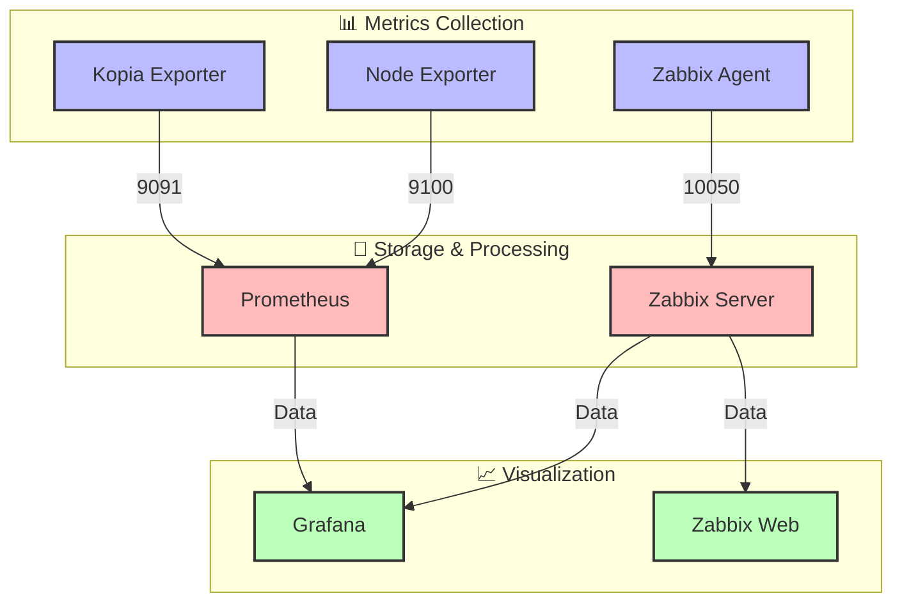
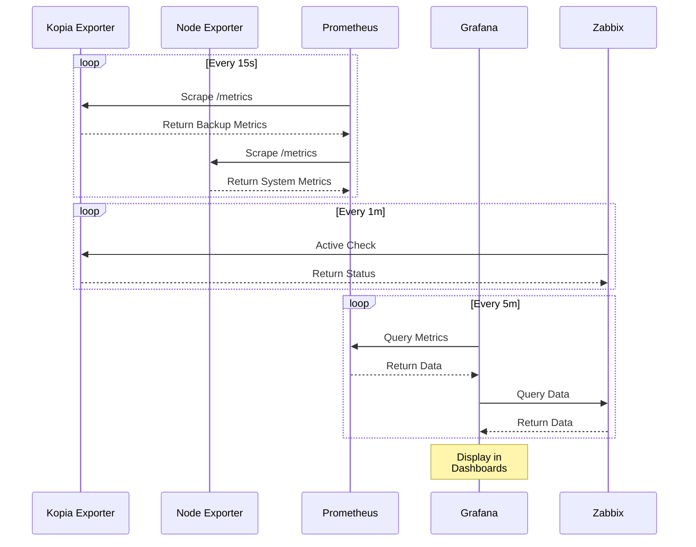

# 📊 Kopia Monitoring Stack

## 🎯 Overview
Comprehensive monitoring solution for Kopia backup system with support for Prometheus, Grafana, and Zabbix.

## 🏗️ Architecture



## 🔄 Data Flow



## 🧩 Components

### 📊 Exporters
- 🔄 **Kopia Exporter**: Custom exporter for Kopia metrics
- 📈 **Node Exporter**: System metrics exporter

### 🎯 Monitoring Systems
- 📝 **Prometheus**: Metrics collection and storage
- 📊 **Grafana**: Visualization and dashboards
- 🔍 **Zabbix**: Enterprise monitoring platform

## 📁 Directory Structure
```
monitoring/
├── 🐳 docker-compose.monitoring.yml    # Main monitoring stack composition
├── 📊 exporters/
│   └── kopia-exporter/             # Custom Kopia metrics exporter
│       ├── Dockerfile
│       ├── main.go
│       └── go.mod
├── 📈 prometheus/
│   └── config/                     # Prometheus configuration
│       └── prometheus.yml
├── 📊 grafana/
│   └── provisioning/              # Grafana provisioning
│       ├── dashboards/
│       └── datasources/
└── 🔍 zabbix/
    └── config/                    # Zabbix agent configuration
        └── zabbix_agentd.d/
            └── userparameter_kopia_client.conf
```

## 📊 Metrics Available

### 🔄 Kopia Metrics (port 9091)
- `kopia_backup_status`: Status of the last backup (0=error, 1=success)
- `kopia_backup_size_bytes`: Size of the last backup in bytes
- `kopia_last_backup_timestamp`: Timestamp of the last backup

### 📈 Node Metrics (port 9100)
Standard node_exporter metrics including:
- 💻 CPU usage
- 🧠 Memory usage
- 💾 Disk space
- 🌐 Network statistics

## ⚙️ Configuration Profiles

### 1. 📊 Base Metrics
```bash
MONITORING_PROFILE=base-metrics
```
Deploys:
- 📝 Prometheus
- 🔄 Kopia Exporter
- 📈 Node Exporter

### 2. 🏠 Local Monitoring
```bash
# 📊 Grafana Local
MONITORING_PROFILE=grafana-local
```

### 3. 🌐 External Services
```bash
# 📊 External Grafana
MONITORING_PROFILE=grafana-external
GRAFANA_URL=http://your-grafana:3000
GRAFANA_API_KEY=your-api-key

# 🔍 External Zabbix
MONITORING_PROFILE=zabbix-external
ZABBIX_SERVER_HOST=your-zabbix-server

# 📈 External Prometheus
MONITORING_PROFILE=prometheus-external
PROMETHEUS_SCRAPE=true

# 🌟 All External Services
MONITORING_PROFILE=all-external
```

## 🔗 Integration Examples

### 📈 Prometheus Configuration
```yaml
scrape_configs:
  - job_name: 'kopia'
    static_configs:
      - targets: ['kopia-host:9091']
  - job_name: 'node'
    static_configs:
      - targets: ['kopia-host:9100']
```

### 📊 Grafana Dashboard
```json
{
  "panels": [
    {
      "title": "Backup Status",
      "targets": [
        {
          "expr": "kopia_backup_status",
          "legendFormat": "{{source}}"
        }
      ]
    }
  ]
}
```

### 🔍 Zabbix Template
```xml
<?xml version="1.0" encoding="UTF-8"?>
<zabbix_export>
    <templates>
        <template>
            <name>Template Kopia Backup</name>
            <items>
                <item>
                    <name>Backup Status</name>
                    <key>kopia.backup.status</key>
                    <type>ZABBIX_ACTIVE</type>
                </item>
            </items>
        </template>
    </templates>
</zabbix_export>
```

## 🔍 Troubleshooting

### 🔄 Check Component Status
```bash
# Check all components
docker compose -f docker-compose.monitoring.yml ps

# Check specific component logs
docker compose -f docker-compose.monitoring.yml logs kopia-exporter
docker compose -f docker-compose.monitoring.yml logs node-exporter
```

### ❗ Common Issues

#### 1. 🔌 Port Conflicts
```bash
# Check if ports are in use
ss -tulpn | grep -E ':(9090|9091|9100|10050)'
```

#### 2. 📊 Metrics Not Available
```bash
# Test Kopia Exporter
curl http://localhost:9091/metrics

# Test Node Exporter
curl http://localhost:9100/metrics
```

#### 3. 🔍 Zabbix Agent Issues
```bash
# Check Zabbix agent logs
docker compose -f docker-compose.monitoring.yml logs zabbix-agent

# Test agent connection
zabbix_get -s localhost -p 10050 -k "agent.ping"
```

## 🔒 Security Considerations

### 🌐 Network Access
- 📈 Prometheus: 9090/tcp
- 🔄 Kopia Exporter: 9091/tcp
- 📊 Node Exporter: 9100/tcp
- 🔍 Zabbix Agent: 10050/tcp

### 📝 Recommendations
1. 🛡️ Use firewall rules to restrict access
2. 🔐 Enable TLS where possible
3. 🔑 Use API keys for external services
4. 🔄 Regular security updates

## 🛠️ Maintenance

### 📝 Log Rotation
```bash
# Check log sizes
du -sh /var/log/monitoring/*

# Manual rotation if needed
logrotate -f /etc/logrotate.d/kopia
```

### 🧹 Cleanup
```bash
# Clean old metrics data
docker volume prune -f --filter "label=com.docker.compose.project=kopia-monitoring"

# Remove unused images
docker image prune -f
```

## 📝 Notes
> 💡 Graph shows how metrics flow through the system.
> 
> 🔗 Components can be deployed independently or together.
> 
> 🎯 Designed for flexibility and scalability.

## 📄 License
MIT