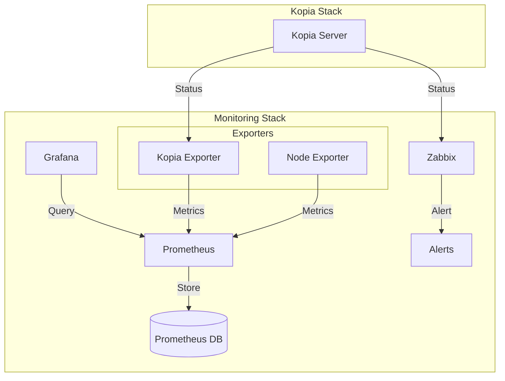

# 📊 Kopia Monitoring Stack

## Overview
Comprehensive monitoring solution for Kopia Backup System including:
- 🔍 Zabbix monitoring for alerts and reporting
- 📊 Prometheus metrics for real-time data
- 📈 Grafana dashboards for visualization
- 📱 Node exporter for system metrics

## Architecture


## Quick Start

1. Configure monitoring in .env:
```bash
# Choose monitoring type
MONITORING_TYPE=all  # all, zabbix, prometheus, none

# Configure networks
KOPIA_NETWORK_NAME=kopia_network
MONITORING_NETWORK_NAME=monitoring_network

# Set ports
PROMETHEUS_UI_PORT=9090
GRAFANA_PORT=3000
KOPIA_EXPORTER_PORT=9091
```

2. Deploy monitoring:
```bash
./scripts/setup_monitoring.sh
```

3. Access dashboards:
- Grafana: http://localhost:3000 (admin/admin)
- Prometheus: http://localhost:9090
- Zabbix: Configure in your Zabbix server

## Components

### 🔍 Prometheus
- Real-time metrics collection
- Data storage and querying
- Custom exporters support
- Default port: 9090

### 📊 Grafana
- Interactive dashboards
- Multiple data sources
- Alert management
- Default port: 3000

### 📈 Exporters
- Kopia metrics exporter
- Node system metrics
- Custom metrics collection
- Default ports: 9091, 9100

### 🚨 Zabbix
- Enterprise monitoring
- Advanced alerting
- Historical data
- Template-based configuration

## Metrics Overview

### Core Metrics
- Backup status and size
- Repository health
- System resources
- Error rates

### Performance Metrics
- Backup duration
- Compression ratio
- Network throughput
- Resource usage

## Security

### Network Security
- Isolated monitoring network
- Limited port exposure
- TLS support (optional)
- Access control

### Authentication
- Grafana password protection
- Prometheus basic auth (optional)
- Zabbix authentication
- Network isolation

## Maintenance

### Logs
```bash
# View component logs
docker logs kopia-prometheus
docker logs kopia-grafana
docker logs kopia-exporter
```

### Backup
```bash
# Backup monitoring data
./scripts/backup_monitoring_data.sh
```

### Updates
```bash
# Update monitoring stack
docker-compose -f docker/docker-compose.monitoring.yml pull
docker-compose -f docker/docker-compose.monitoring.yml up -d
```

## Troubleshooting

### Common Issues
1. Prometheus can't scrape metrics:
```bash
# Check network connectivity
docker network inspect monitoring_network
# Check exporter status
curl http://localhost:9091/metrics
```

2. Grafana can't connect:
```bash
# Verify Prometheus connection
curl http://localhost:9090/api/v1/query?query=up
```

3. Missing data:
```bash
# Check exporter logs
docker logs kopia-exporter
# Verify metrics
curl http://localhost:9091/metrics | grep kopia
```

## Additional Resources
- [Prometheus Documentation](https://prometheus.io/docs/)
- [Grafana Documentation](https://grafana.com/docs/)
- [Zabbix Documentation](https://www.zabbix.com/documentation/) 