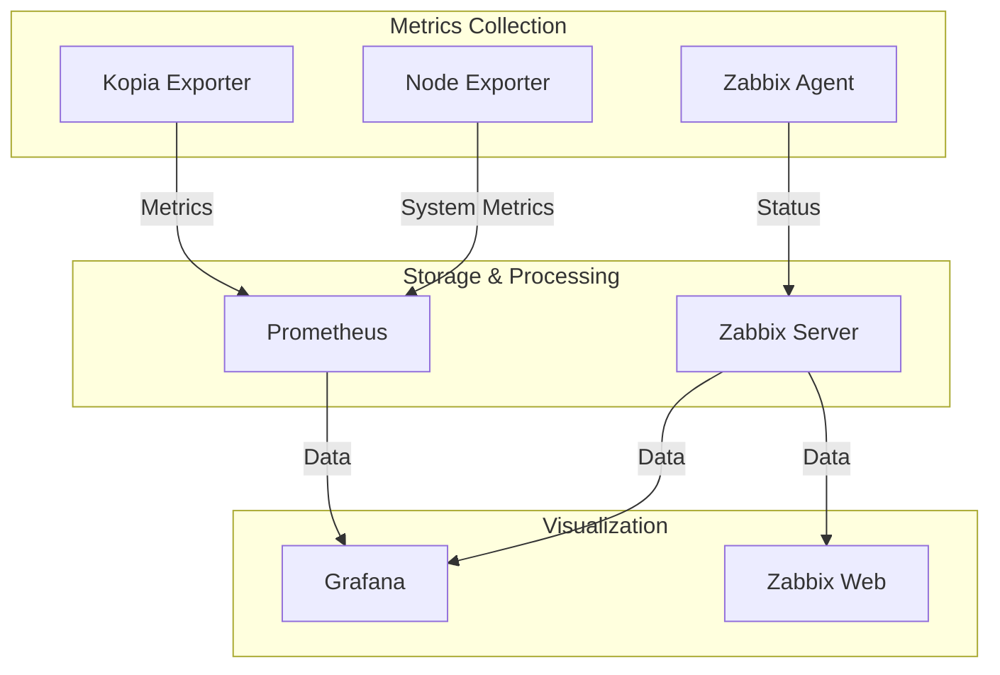

# 📊 Kopia Monitoring Stack

## Table of Contents
- [Overview](#overview)
- [Architecture](#architecture)
- [Components](#components)
- [Installation](#installation)
- [Configuration](#configuration)
- [Monitoring Profiles](#monitoring-profiles)
- [Metrics & Alerts](#metrics--alerts)
- [Maintenance](#maintenance)
- [Troubleshooting](#troubleshooting)

## Overview

The Kopia Monitoring Stack provides comprehensive monitoring capabilities:
- 🔄 Real-time backup status monitoring
- 📈 Performance metrics collection
- 🚨 Intelligent alerting system
- 📊 Customizable dashboards
- 🛠️ Maintenance tools

## Architecture



## Components

### Core Components
- **Kopia Exporter**: Custom metrics from Kopia
- **Node Exporter**: System metrics
- **Zabbix Agent**: Status monitoring
- **Prometheus**: Metrics storage
- **Grafana**: Visualization
- **Zabbix**: Enterprise monitoring

## Monitoring Profiles

### Profile Comparison

| Feature | none | base-metrics | grafana-local | grafana-external | zabbix-external | prometheus-external | grafana-zabbix-external | all-external | full-stack |
|---------|------|--------------|---------------|------------------|-----------------|-------------------|----------------------|--------------|------------|
| Kopia Exporter | ❌ | ✅ | ✅ | ✅ | ❌ | ✅ | ✅ | ✅ | ✅ |
| Node Exporter | ❌ | ✅ | ✅ | ✅ | ❌ | ✅ | ✅ | ✅ | ✅ |
| Zabbix Agent | ❌ | ❌ | ❌ | ❌ | ✅ | ❌ | ✅ | ✅ | ✅ |
| Local Prometheus | ❌ | ✅ | ✅ | ❌ | ❌ | ❌ | ❌ | ❌ | ✅ |
| Local Grafana | ❌ | ❌ | ✅ | ❌ | ❌ | ❌ | ❌ | ❌ | ✅ |
| Local Zabbix | ❌ | ❌ | ❌ | ❌ | ❌ | ❌ | ❌ | ❌ | ✅ |
| External Grafana | ❌ | ❌ | ❌ | ✅ | ❌ | ❌ | ✅ | ✅ | ❌ |
| External Zabbix | ❌ | ❌ | ❌ | ❌ | ✅ | ❌ | ✅ | ✅ | ❌ |
| External Prometheus | ❌ | ❌ | ❌ | ❌ | ❌ | ✅ | ❌ | ✅ | ❌ |

### Profile Details

1. **No Monitoring** (`none`)
```bash
MONITORING_PROFILE=none
```
- All monitoring components disabled
- No metrics collection
- Minimal resource usage
- Suitable for testing or development

2. **Base Metrics** (`base-metrics`)
```bash
MONITORING_PROFILE=base-metrics
```
- Local Prometheus instance
- Kopia and Node exporters
- No visualization
- Basic metrics collection
- Minimal resource footprint
- Suitable for integration with existing monitoring

3. **Local Grafana** (`grafana-local`)
```bash
MONITORING_PROFILE=grafana-local
GRAFANA_ADMIN_PASSWORD=your-password
```
- Local Prometheus + Grafana
- Kopia and Node exporters
- Pre-configured dashboards
- Local metrics storage
- Full visualization capabilities
- Self-contained monitoring solution

4. **External Grafana** (`grafana-external`)
```bash
MONITORING_PROFILE=grafana-external
GRAFANA_URL=http://your-grafana:3000
GRAFANA_API_KEY=your-api-key
```
- Connects to existing Grafana
- Local Prometheus instance
- Kopia and Node exporters
- Custom dashboard provisioning
- Uses existing visualization platform

5. **External Zabbix** (`zabbix-external`)
```bash
MONITORING_PROFILE=zabbix-external
ZABBIX_SERVER=your-zabbix-server
ZABBIX_SERVER_PORT=10051
```
- Connects to existing Zabbix server
- Zabbix agent only
- Custom templates and triggers
- No Prometheus/Grafana components
- Traditional monitoring approach

6. **External Prometheus** (`prometheus-external`)
```bash
MONITORING_PROFILE=prometheus-external
PROMETHEUS_URL=http://your-prometheus:9090
PROMETHEUS_BASIC_AUTH=true
```
- Connects to existing Prometheus
- Kopia and Node exporters
- No local storage
- Exports metrics to external system
- Integration with existing monitoring

7. **External Grafana + Zabbix** (`grafana-zabbix-external`)
```bash
MONITORING_PROFILE=grafana-zabbix-external
GRAFANA_URL=http://your-grafana:3000
ZABBIX_SERVER=your-zabbix-server
```
- Hybrid monitoring setup
- Connects to existing Grafana and Zabbix
- Kopia and Node exporters
- Zabbix agent
- Combined metrics from both systems
- Best of both worlds approach

8. **All External** (`all-external`)
```bash
MONITORING_PROFILE=all-external
```
- Uses all external systems
- No local monitoring components
- Maximum flexibility
- Minimal local resource usage
- Complex integration scenarios
- Requires existing infrastructure

9. **Full Stack** (`full-stack`)
```bash
MONITORING_PROFILE=full-stack
```
- Complete local installation
- All components included:
  - Prometheus
  - Grafana
  - Zabbix
  - All exporters
- Maximum control
- Highest resource usage
- Perfect for development/testing
- Self-contained solution

### Resource Requirements

| Profile | CPU | Memory | Disk |
|---------|-----|---------|------|
| none | - | - | - |
| base-metrics | 0.5 | 512MB | 5GB |
| grafana-local | 1.0 | 1GB | 10GB |
| grafana-external | 0.5 | 512MB | 5GB |
| zabbix-external | 0.2 | 256MB | 1GB |
| prometheus-external | 0.5 | 512MB | 1GB |
| grafana-zabbix-external | 0.5 | 512MB | 1GB |
| all-external | 0.5 | 512MB | 1GB |
| full-stack | 2.0 | 2GB | 20GB |

## Installation

### Prerequisites
```bash
# System requirements
- Docker 20.10+
- 2GB RAM minimum
- 10GB disk space
```

### Basic Setup
```bash
# Clone repository
git clone https://github.com/username/kopia-backup-stack
cd kopia-backup-stack

# Configure environment
cp .env.example .env
nano .env

# Start monitoring
./scripts/setup_monitoring.sh
```

## Configuration

### Environment Variables
```bash
# Basic Settings
MONITORING_PROFILE=full-stack
GRAFANA_ADMIN_PASSWORD=secure-password

# External Services
GRAFANA_URL=http://grafana:3000
PROMETHEUS_URL=http://prometheus:9090
ZABBIX_SERVER=zabbix-server

# Authentication
MONITORING_BASIC_AUTH=true
MONITORING_AUTH_USER=admin
MONITORING_AUTH_PASSWORD=secure-pass

# Resources
PROMETHEUS_CPU_LIMIT=1
PROMETHEUS_MEM_LIMIT=2G
```

## Metrics & Alerts

### Key Metrics

1. Backup Metrics
```promql
# Backup Status
kopia_backup_status{source="path"}

# Backup Size
rate(kopia_backup_size_bytes[5m])
```

2. Repository Metrics
```promql
# Repository Status
kopia_repository_status

# Free Space
kopia_repository_free_space_bytes
```

### Alert Rules

1. Backup Failures
```yaml
- alert: KopiaBackupFailed
  expr: kopia_backup_status == 0
  for: 5m
  labels:
    severity: critical
```

2. Space Issues
```yaml
- alert: KopiaRepositoryLowSpace
  expr: kopia_repository_free_space_bytes < 10GB
  for: 15m
  labels:
    severity: warning
```

## Maintenance

### Daily Tasks
```bash
# Check backup status
docker exec kopia-server kopia snapshot list --last 24h

# Verify metrics
curl -s http://localhost:9091/metrics
```

### Weekly Tasks
```bash
# Check monitoring stack
docker compose ps

# Verify alerts
curl -s http://localhost:9090/api/v1/alerts
```

### Monthly Tasks
```bash
# Update components
docker compose pull
docker compose up -d

# Review dashboards
./scripts/backup_dashboards.sh
```

## Troubleshooting

### Common Issues

1. Missing Metrics
```bash
# Check exporter
curl -s http://localhost:9091/metrics

# Verify Prometheus targets
curl -s http://localhost:9090/api/v1/targets
```

2. Dashboard Issues
```bash
# Check Grafana
docker logs grafana

# Verify datasource
curl -H "Authorization: Bearer ${GRAFANA_API_KEY}" \
     http://localhost:3000/api/datasources
```

### Performance Optimization

1. Prometheus Storage
```yaml
storage:
  tsdb:
    retention.time: 15d
    retention.size: 10GB
```

2. Grafana Resources
```yaml
grafana:
  resources:
    limits:
      cpus: '1'
      memory: 1G
```

### Health Checks
```bash
# Check all components
./scripts/check_monitoring.sh

# Individual checks
curl -s http://localhost:9091/health
curl -s http://localhost:9090/-/healthy
curl -s http://localhost:3000/api/health
```

## Best Practices

### Monitoring
- Regular metric validation
- Alert tuning
- Dashboard optimization
- Resource monitoring
- Log rotation

### Maintenance
- Regular updates
- Configuration backups
- Performance tuning
- Security patches
- Documentation updates

### Security
- Authentication enabled
- TLS encryption
- Regular audits
- Access control
- Secure communication