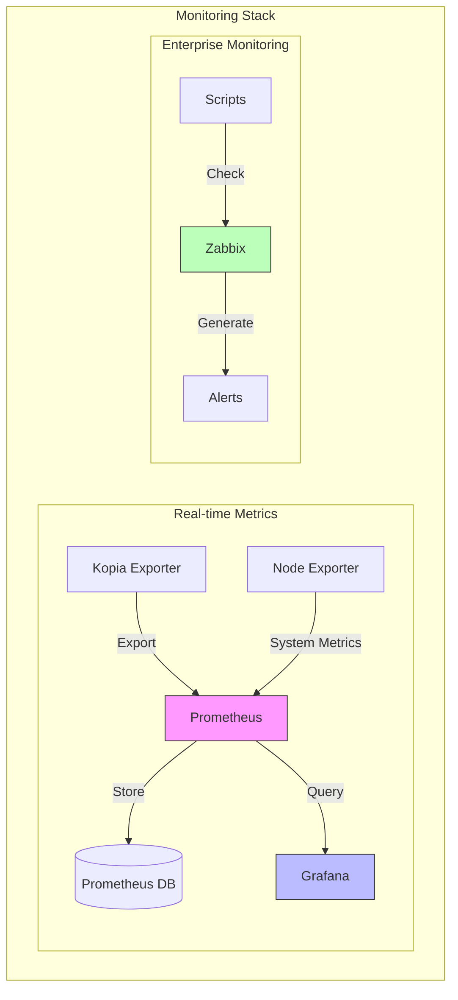

# 📊 Kopia Monitoring Stack

## 📋 Overview
Integrated monitoring solution for Kopia Backup System:
- 🔍 Prometheus metrics collection
- 📈 Grafana visualization
- 🚨 Zabbix enterprise monitoring
- 📱 Mobile-friendly dashboards

## 🏗️ Architecture



## 🚀 Quick Start

### 1. Prerequisites
- Docker & Docker Compose installed
- Running Kopia server
- 2GB free RAM for monitoring
- 10GB disk space for metrics

### 2. Configuration
```bash
# Basic monitoring setup
MONITORING_TYPE=prometheus
PROMETHEUS_ENABLE=true
GRAFANA_ADMIN_PASSWORD=secure-password

# Enterprise monitoring
MONITORING_TYPE=all
ZABBIX_ENABLE=true
```

### 3. Deployment
```bash
# Deploy stack
./scripts/setup_monitoring.sh

# Verify components
curl -s http://localhost:9090/-/healthy
curl -s http://localhost:3000/api/health
curl -s http://localhost:9091/metrics
```

## 📊 Component Details

### 1. Prometheus Stack
- **Kopia Exporter**: Custom metrics from Kopia
- **Node Exporter**: System metrics
- **Prometheus**: Metrics storage
- **Grafana**: Visualization

### 2. Zabbix Integration
- **Scripts**: Backup validation
- **Templates**: Pre-configured monitoring
- **Alerts**: Automated notifications

### 3. Health Checks
- Component status monitoring
- Automatic recovery
- Alert notifications

## 📈 Available Metrics

### Backup Metrics
| Metric | Type | Description |
|--------|------|-------------|
| kopia_backup_size_bytes | Gauge | Backup size |
| kopia_backup_duration_seconds | Gauge | Backup duration |
| kopia_repository_size_bytes | Gauge | Repository size |
| kopia_backup_validation | Gauge | Validation status |

### System Metrics
| Metric | Type | Description |
|--------|------|-------------|
| node_filesystem_free_bytes | Gauge | Free storage |
| node_memory_MemAvailable_bytes | Gauge | Available memory |
| node_cpu_seconds_total | Counter | CPU usage |

## 🛠 Troubleshooting

### Common Issues

1. Metrics Not Available
```bash
# Check exporter
docker logs kopia-exporter
curl http://localhost:9091/metrics

# Check Prometheus
curl http://localhost:9090/api/v1/targets
```

2. Grafana Issues
```bash
# Reset admin password
docker exec -it kopia-grafana grafana-cli admin reset-admin-password

# Check datasource
curl http://localhost:3000/api/datasources/proxy/1/api/v1/query?query=up
```

3. Zabbix Integration
```bash
# Test scripts
/usr/lib/zabbix/externalscripts/check_kopia_backup.sh
/usr/lib/zabbix/externalscripts/check_repository.sh
```

## 🔒 Security

### Network Security
- Isolated monitoring network
- Internal service discovery
- Optional TLS encryption

### Access Control
- Grafana authentication
- Prometheus basic auth
- Network isolation

## 📚 Additional Resources
- [Prometheus Best Practices](https://prometheus.io/docs/practices/naming/)
- [Grafana Dashboards](https://grafana.com/grafana/dashboards/)
- [Zabbix Templates](https://www.zabbix.com/integrations/)