# 🔍 Kopia Zabbix Integration

## 🎯 Overview
Zabbix monitoring integration for Kopia backup system with custom templates and triggers.

## 🏗️ Architecture

```mermaid
graph TB
    subgraph "🔄 Kopia Client"
        KS[Kopia Server]
        ZA[Zabbix Agent]
        KE[Kopia Exporter]
    end
    
    subgraph "🔍 Zabbix Server"
        ZS[Zabbix Server]
        ZW[Zabbix Web]
        ZD[(Zabbix DB)]
    end
    
    ZA -->|Active Checks| ZS
    KE -->|Metrics| ZA
    ZS -->|Store| ZD
    ZW -->|Read| ZD
    
    classDef client fill:#bbf,stroke:#333,stroke-width:2px;
    classDef server fill:#fbb,stroke:#333,stroke-width:2px;
    classDef db fill:#bfb,stroke:#333,stroke-width:2px;
    
    class KS,ZA,KE client;
    class ZS,ZW server;
    class ZD db;
```



## 📁 Directory Structure
```
zabbix/
├── 📝 config/
│   └── zabbix_agentd.d/
│       └── userparameter_kopia_client.conf  # Custom Kopia parameters
├── 📊 templates/
│   └── template_kopia_backup.xml           # Zabbix monitoring template
└── 📜 scripts/
    └── kopia_metrics.sh                    # Helper scripts
```

## 📊 Available Metrics

### 🔄 Backup Status
- `kopia.backup.status` - Current backup status (0=error, 1=success)
- `kopia.backup.last_run` - Timestamp of last backup
- `kopia.backup.size` - Total backup size in bytes

### 💾 Repository Status
- `kopia.repo.status` - Repository health (0=error, 1=ok)
- `kopia.repo.size` - Repository size in bytes
- `kopia.repo.objects` - Number of objects in repository

### 🚦 Performance Metrics
- `kopia.performance.upload_speed` - Current upload speed
- `kopia.performance.download_speed` - Current download speed
- `kopia.performance.compression_ratio` - Achieved compression ratio

## ⚙️ Configuration

### 🔧 Agent Configuration
```ini
# zabbix_agentd.d/userparameter_kopia_client.conf
UserParameter=kopia.backup.status,/usr/local/bin/kopia_metrics.sh status
UserParameter=kopia.backup.size,/usr/local/bin/kopia_metrics.sh size
UserParameter=kopia.repo.status,/usr/local/bin/kopia_metrics.sh repo
```

### 🎯 Triggers
```xml
<trigger>
    <name>Kopia Backup Failed</name>
    <expression>{Template Kopia:kopia.backup.status.last()}=0</expression>
    <priority>HIGH</priority>
</trigger>
```

### 📈 Graphs
```xml
<graph>
    <name>Kopia Backup Size</name>
    <item>
        <key>kopia.backup.size</key>
        <color>00AA00</color>
    </item>
</graph>
```

## 🚀 Quick Start

### 1. 📦 Installation
```bash
# Deploy Zabbix agent
docker compose -f docker-compose.zabbix_agent.yml up -d

# Verify agent is running
docker ps | grep zabbix-agent
```

### 2. 🔗 Integration
```bash
# Add host to Zabbix server
zabbix_sender -z zabbix-server -s "kopia-client" -k kopia.backup.status -o 1

# Import template
zabbix_sender -z zabbix-server -i template_kopia_backup.xml
```

## 🔍 Troubleshooting

### 🔄 Check Agent Status
```bash
# Test agent connection
zabbix_get -s localhost -p 10050 -k agent.ping

# Check agent logs
docker logs kopia-zabbix-agent
```

### ❗ Common Issues

#### 1. 🔌 Connection Issues
```bash
# Check if agent is listening
netstat -tulpn | grep 10050

# Test firewall
telnet zabbix-server 10051
```

#### 2. 🔑 Authentication Problems
```bash
# Verify PSK configuration
cat /etc/zabbix/zabbix_agentd.conf | grep PSK

# Check permissions
ls -la /etc/zabbix/zabbix_agentd.d/
```

## 📝 Notes
> 💡 Active checks are preferred for better security.
> 
> 🔒 Always use encryption in production.
> 
> 🔄 Regular template updates recommended.

## 🛠️ Maintenance

### 🧹 Log Cleanup
```bash
# Rotate agent logs
logrotate -f /etc/logrotate.d/zabbix-agent

# Clean old data
find /var/log/zabbix -name "*.old" -delete
```

### 🔄 Updates
```bash
# Update agent
docker compose -f docker-compose.zabbix_agent.yml pull
docker compose -f docker-compose.zabbix_agent.yml up -d

# Verify after update
docker ps | grep zabbix-agent
```

## 🔗 Related Documentation
- 📚 [Zabbix Agent Documentation](https://www.zabbix.com/documentation/current/manual/concepts/agent)
- 📊 [Template Reference](https://www.zabbix.com/documentation/current/manual/config/templates)
- 🔧 [Custom Parameters](https://www.zabbix.com/documentation/current/manual/config/items/userparameters)